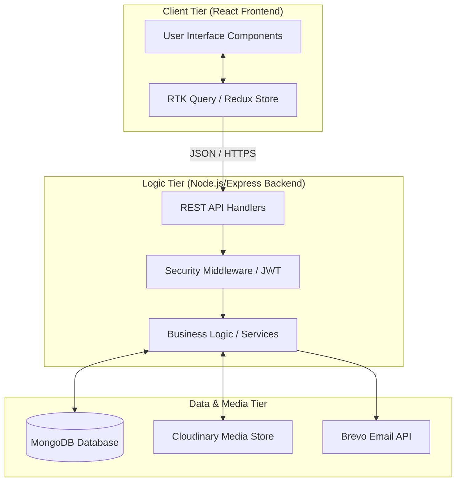
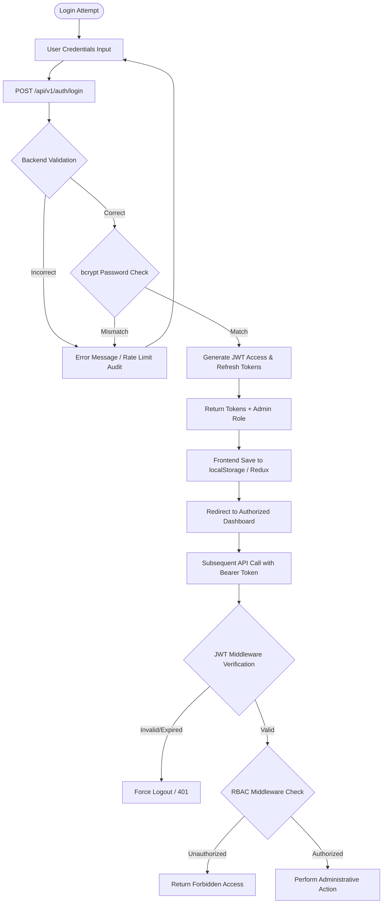
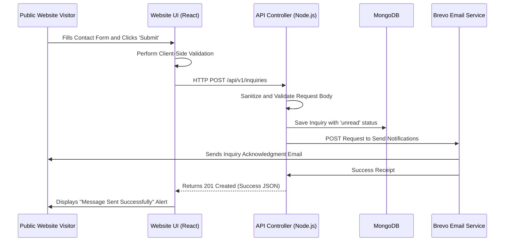
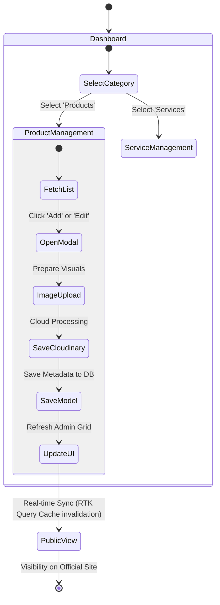
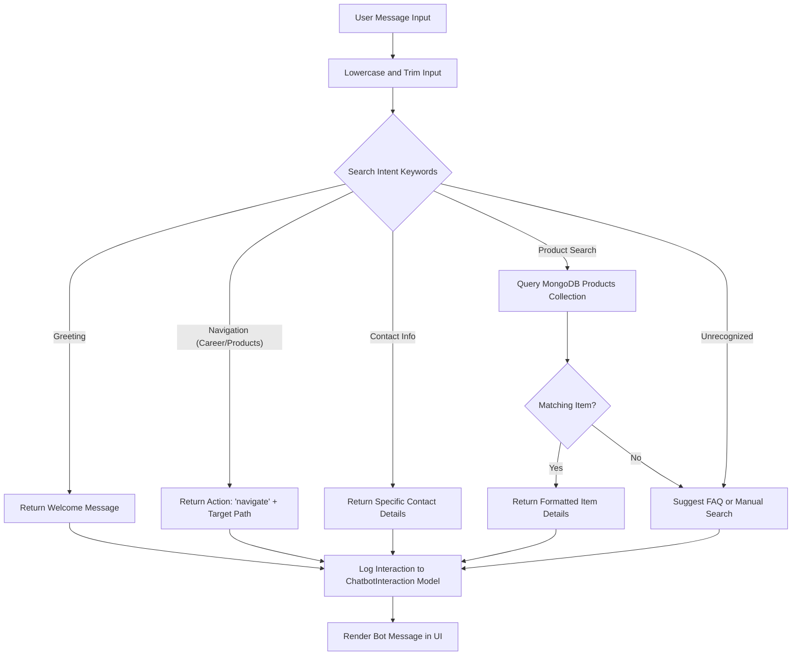
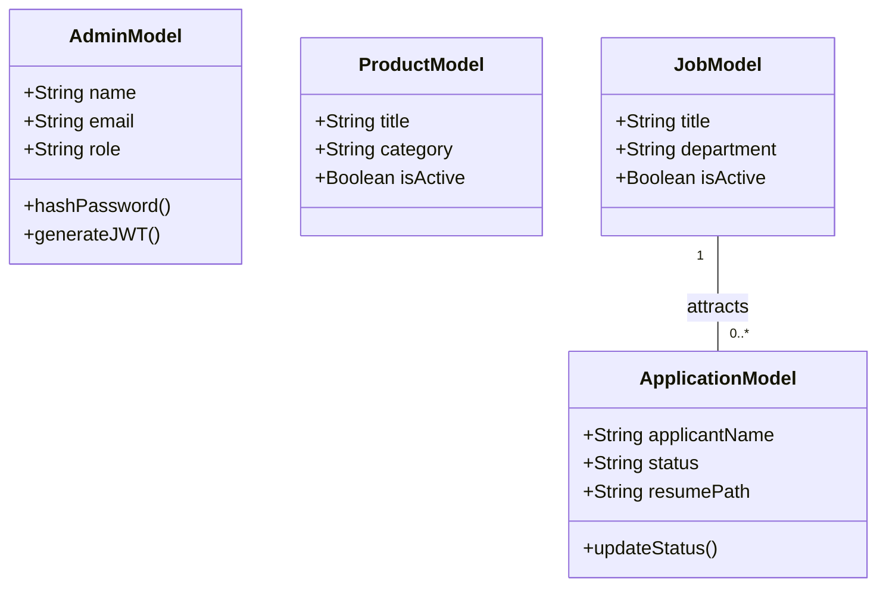

# FINAL PROJECT DOCUMENTATION: DIPHARMA MANAGEMENT SYSTEM

## 1. INTRODUCTION

### 1.1 Introduction to Project
The DiPharma Management System is a comprehensive, enterprise-level full-stack web application meticulously engineered to modernize the operational framework of a contemporary pharmaceutical organization. In today's rapidly evolving digital economy, pharmaceutical companies require more than just a web presence; they need an integrated ecosystem capable of managing complex data, facilitating stakeholder engagement, and providing real-time operational insights. DiPharma addresses these needs by providing a scalable, secure, and highly interactive platform that bridges the gap between public engagement and internal administration.

The system's architecture is built on the principles of modularity and high availability. By employing a decoupled Client-Server model, the project ensures that the presentation layer (React.js) and the logic layer (Node.js/Express) can be scaled and maintained independently. This design philosophy not only enhances the system's performance but also provides the flexibility required to adapt to changing business requirements. The integration of advanced features such as interactive 3D visualizations, automated communication workflows, and a rule-based chatbot positions the DiPharma project at the cutting edge of pharmaceutical information technology.

Furthermore, DiPharma emphasizes the importance of data-driven governance. The platform is equipped with an advanced analytics suite that transforms raw operational data into actionable visual insights. Whether tracking recruitment trends through job applications or measuring customer interest through inquiries, the system provides administrators with the tools necessary to make informed strategic decisions. This holistic approach to system design ensures that DiPharma is not merely a software product but a strategic asset that enhances the organization's credibility, efficiency, and market competitiveness.

Finally, the project serves as a robust demonstration of modern web engineering capabilities. It integrates a diverse tech stack—including MongoDB for persistence, Cloudinary for media, and Brevo for messaging—into a unified workflow. The meticulous attention to detail in the user interface, combined with the rigorous security protocols at the backend, ensures a premium experience for all users. DiPharma sets a new standard for pharmaceutical management systems, offering a future-proof foundation for the digital evolution of the pharmaceutical industry.

### 1.2 Purpose of the Project
The primary purpose of the DiPharma project is to establish a centralized, high-performance digital repository for all pharmaceutical data and stakeholder interactions. Historically, many pharmaceutical SMEs have struggled with fragmented data management, relying on disconnected legacy systems or manual record-keeping. The DiPharma system solves this by providing a "single source of truth," where product information, service details, career listings, and customer inquiries are stored in a unified MongoDB database. This centralization ensures data integrity and provides a consistent experience across all digital touchpoints.

Another critical purpose is the optimization of organizational workflows through automation. The system is designed to handle high-volume administrative tasks—such as job application processing and inquiry management—with minimal human intervention. Automated email notifications and acknowledgments ensure that the company maintains a professional and responsive communication channel with its stakeholders. By reducing the manual burden on HR and support staff, the system allows the organization to reallocate resources toward higher-value activities, thereby improving overall operational agility.

The project also aims to enhance the professional brand identity of the pharmaceutical firm. In an industry where trust and precision are paramount, the premium aesthetic and technical sophistication of the DiPharma platform serve as a powerful branding tool. Features like the interactive 3D globe and the voice-activated chatbot demonstrate a commitment to innovation and user accessibility. This enhanced digital presence not only builds trust with existing clients but also serves as a strategic differentiator in an increasingly competitive global market.

Ultimately, the purpose of DiPharma is to provide a scalable and extensible foundation for the organization's digital future. The system is designed with a long-term vision, allowing for easy integration of future enhancements such as AI-driven predictive analytics, e-commerce capabilities, and native mobile applications. By investing in a robust, modern architecture from the outset, the organization ensures that its digital infrastructure can grow in tandem with its business objectives, maintaining its technological leadership in the pharmaceutical sector for years to come.

## 2. SYSTEM ANALYSIS

### 2.1 Introduction
System Analysis is a foundational phase in the DiPharma development lifecycle, focusing on the meticulous examination of the pharmaceutical management domain. This phase involved a comprehensive study of the existing processes within the organization to identify structural weaknesses and opportunities for digital optimization. By conducting a systematic analysis, the team was able to define the functional boundaries of the system and establish a rigorous set of requirements that align with both business objectives and technical constraints.

The analysis phase also utilized various modeling techniques to abstract the system's complexities into manageable logical components. This included the use of Data Flow Diagrams (DFDs) to map information movement and Use Case modeling to define actor-system interactions. This rigorous analytical foundation ensured that every feature implemented in the final system—from the chatbot's navigation logic to the dashboard's analytics engine—is built upon a clear understanding of the real-world challenges it is intended to solve.

Moreover, the system analysis focus extended to the data requirements of the pharmaceutical industry, emphasizing the need for structured, scalable storage. The analysis identified the core entities (Products, Services, Jobs, Inquiries) and their complex interrelationships, which directly informed the design of the MongoDB schema. This focus on data analysis ensures that the system can handle large volumes of diverse information while maintaining the high levels of query performance and data integrity required for enterprise-grade pharmaceutical management.

### 2.2 Analysis Model
The Analysis Model for DiPharma is rooted in the principles of Object-Oriented Analysis (OOA), where the system is viewed as a collection of interacting objects. Each core entity, such as a 'Service' or an 'Application,' is modeled with specific attributes and behaviors. This modeling approach ensures that the system is modular and that logical concerns are encapsulated within their respective domain objects. This not only simplifies the development process but also ensures that the system is highly maintainable and adaptable to future changes in business logic.

Furthermore, the system employs a Resource-Oriented Analysis model, aligning with RESTful architectural standards. Every piece of data in the system is considered a resource with a unique URI, and interactions are modeled around standard HTTP verbs. This clean abstraction provides a solid contract between the frontend (React) and the backend (Express), ensuring that data is exchanged in a structured, predictable JSON format. This model-driven approach to API design is essential for building a robust and scalable communication layer between the client and server.

In addition to structural modeling, the analysis also incorporates a security-centric behavioral model. This involves modeling the system's response to various authentication states and user roles. By explicitly modeling the transitions between standard, admin, and super-admin states, the analysis ensures that the system's role-based access control (RBAC) is logically sound and consistently enforced across all modules. This integrated approach to modeling is critical for maintaining the high security standards expected in pharmaceutical information management.

### 2.3 SDLC Phases
The development of DiPharma followed the **Agile-Scrum** framework, characterized by iterative cycles and a strong emphasis on stakeholder feedback. The project was divided into several phases:
1.  **Inception & Requirements**: Definition of the project's vision and the documentation of functional and non-functional requirements in a rigorous SRS.
2.  **Architectural Design**: Formation of the technical blueprint, including the database schema, API contracts, and high-fidelity UI/UX mockups.
3.  **Iterative Development (Sprints)**: The core implementation phase where features were developed in two-week intervals. Concurrent development of the frontend and backend ensured that integration issues were identified and resolved early.
4.  **Rigorous Testing**: A multi-tiered testing cycle involving unit, integration, and end-to-end system testing to ensure the platform's reliability and security.
5.  **Deployment & Launch**: Hosting the application on industrial cloud platforms and performing final environmental configurations.
6.  **Continuous Maintenance**: Ongoing monitoring and optimization of the system to ensure it remains secure and performs at peak efficiency.

This structured SDLC ensured that the project was delivered on time and within scope while maintaining a high level of software quality. The Agile approach allowed for continuous refinement of features based on evolving needs, ensuring that the final product is a perfect fit for the organization's requirements.

### 2.4 Hardware & Software Requirements
To maintain the high-performance standards of the DiPharma system, the following hardware and software benchmarks are recommended:

**Hardware Requirements:**
- **Server Infrastructure:** High-performance multi-core processor (Min 4 cores), 16GB RAM for optimal concurrency, and 100GB+ SSD storage. Stable, high-bandwidth fiber-optic connectivity for real-time API performance.
- **Client Infrastructure:** Modern PC or mobile device with a minimum of 4GB RAM and a high-definition display. A modern GPU is recommended for optimal rendering of GSAP and SVG animations.

**Software Requirements:**
- **Runtime Environment:** Node.js v18.x or v20.x (LTS recommended).
- **Database Layer:** MongoDB Enterprise or Atlas managed instance (v6.0+).
- **Browser Compatibility:** Latest versions of Chrome, Edge, Firefox, and Safari (to support Web Speech API and advanced CSS/JS animations).
- **Operating Systems:** Fully compatible with Windows Server, Linux (Ubuntu/Debian), and macOS.
- **DevOps Tools:** Git for version control, Docker for containerization (optional), and PM2 for process management in production.

### 2.5 Input and Output
The system's processing logic is driven by a diverse set of inputs that are transformed into high-value outputs. **Inputs** include structured form data from inquiries and job applications, multi-part file uploads (resumes), and administrative content updates. The chatbot also processes natural language text and voice-transcribed audio. These inputs are rigorously validated at the API layer to ensure they conform to the system's data integrity rules before being persisted in the database.

**Outputs** are delivered in multiple formats to provide maximum utility:
- **Dynamic Web Views**: High-fidelity React components that present products, services, and company information.
- **Analytical Dashboards**: Real-time visual reports using charts and graphs for executive-level insights.
- **Transactional Communications**: Automated HTML emails sent via the Brevo API to notify users and administrators of system events.
- **Structured Data Reports**: Downloadable XLSX files for offline data analysis and historical record-keeping.
- **System Logs**: Comprehensive traces of API activity and error states, essential for technical monitoring and auditing.

### 2.6 Limitations
While DiPharma is a robust enterprise-grade application, it has defined boundaries that guide its current scope. The system's chatbot utilizes a rule-based intent matching algorithm; while highly effective for structured queries, it does not possess the generative capabilities of modern LLMs. Additionally, the system's external functionalities, such as image hosting and email delivery, are dependent on the uptime of third-party cloud architectures (Cloudinary and Brevo).

Another limitation is its optimization for modern web browsers. While the system is highly responsive, users on extremely legacy browsers may encounter minor visual discrepancies or reduced performance in complex animations. Furthermore, the system is primarily focused on information management and lead generation; as such, it does not currently include native e-commerce transaction capabilities. These limitations are clearly documented to provide a baseline for future architectural expansions and feature updates.

### 2.7 Existing System
Existing methods in many pharmaceutical organizations are characterized by extreme fragmentation. Many firms still rely on static websites that lack interactivity and require manual coding for updates. Communication is often handled through generic email addresses without any structured tracking, leading to delayed responses. Recruitment is particularly inefficient, with resumes scattered across multiple inboxes without a centralized database for filtering or status tracking.

Furthermore, legacy systems typically provide zero analytical visibility. Management has no way of knowing which products are drawing interest or how users are engaging with their content. Security is also a major concern, as these systems often lack robust authentication and input validation, making them vulnerable to modern cyber-threats. The absence of a unified management platform results in operational inefficiencies and a sub-optimal brand experience for modern users.

### 2.8 Proposed System
The proposed DiPharma system replaces these fragmented processes with a unified, high-performance enterprise ecosystem. Built on the MERN-lite stack, the system provides a centralized repository for all organizational data, ensuring consistency and accuracy across all modules. The integration of advanced features such as the rule-based chatbot and the visual analytics dashboard significantly improves engagement and strategic visibility. Automation is at the core of the proposed system, reducing the manual administrative burden and ensuring professional-grade communication.

Security and scalability are prioritized through the use of JWT-based authentication, RBAC, and a decoupled architecture. This ensures that the system can grow in tandem with the organization's needs while maintaining the highest standards of data protection. The DiPharma system moves the organization from a reactive, manual mode of operation to a proactive, data-driven digital presence, establishing a premium brand identity in the competitive pharmaceutical market.

## 3. FEASIBILITY REPORT

### 3.1 Technical Feasibility
Technical feasibility centers on the project's viability using existing technological resources and expertise. DiPharma leverages the JavaScript ecosystem (React, Node, Express, MongoDB), which is the most supported and well-documented stack in modern engineering. The development team is highly proficient in these technologies, ensuring that complex integrations like the chatbot's navigation logic and the dashboard's analytics can be implemented without significant risk. The use of specialized cloud APIs for media and messaging further enhances the system's technical robustness, providing industrial-grade scaling capabilities from the outset.

### 3.2 Operational Feasibility
Operational feasibility evaluates how well the system will be integrated into the organization's daily workflows. DiPharma is designed with a strong focus on administrative usability, featuring an intuitive dashboard that requires minimal technical training. The automated recruitment and inquiry workflows significantly reduce the manual workload on HR and support staff, making the system an operational asset. Furthermore, the system's mobile responsiveness ensures that administrators can monitor and manage the platform from anywhere, supporting a modern and flexible organizational environment.

### 3.3 Economic Feasibility
Economic feasibility involves a cost-benefit analysis where the projected benefits are weighed against the development and operational costs. By utilizing open-source frameworks and scalable cloud services with generous free tiers, the initial investment is kept manageable. The long-term benefits are substantial: increased operational efficiency through automation, improved lead conversion through better inquiry management, and a significant boost to the organization's digital brand value. The strategic insights provided by the analytics module offer high strategic value, making the DiPharma project an economically sound and high-ROI investment.

## 4. SOFTWARE REQUIREMENT SPECIFICATION

### 4.1 Functional Requirements
Functional requirements define the core behaviors of the system:
- **Authentication & RBAC**: Secure multi-role login system for Admin and Super Admin roles.
- **Content CMS**: Full CRUD capabilities for managing products, services, FAQs, and job listings.
- **Recruitment Engine**: Career portal for job seekers to browse listings and submit applications with resume uploads.
- **Communication Hub**: Functional interaction through the chatbot and contact form with automated email alerts.
- **Analytics Module**: Real-time data visualization on the dashboard for tracking inquiry and application trends.
- **Global Search**: Unified search engine to query public content across the entire application.

### 4.2 Non-Functional Requirements
Non-functional requirements specify the quality attributes:
- **Security**: Robust protection including bcrypt password hashing, JWT authorization, and input sanitization.
- **Performance**: High-speed performance with API response times < 200ms and smooth 60fps animations.
- **Responsiveness**: Fully adaptive UI that provides a seamless experience across mobile, tablet, and desktop.
- **Reliability**: High system uptime with graceful error handling and reliable third-party API integrations.
- **Scalability**: Architecture designed to handle increasing data volume and traffic without performance degradation.

### 4.3 Performance Requirements
Performance is a critical metric for the success of DiPharma. The system uses asynchronous I/O and database indexing to ensure that even complex management tasks remain instantaneous. The frontend utilizes Vite's optimized build process and React's virtual DOM to minimize rendering overhead. Media assets are delivered through Cloudinary's global CDN, ensuring that visual content loads rapidly for users worldwide. These performance standards ensure that DiPharma provides a fluid, professional experience that meets the high expectations of an international pharmaceutical enterprise.

## 5. SYSTEM DEVELOPMENT ENVIRONMENT

### 5.1 Introduction to Technologies Used
The DiPharma development environment is built on a modern, unified JavaScript stack designed for maximum efficiency and scalability. By using a single language across the entire application, the project benefits from shared logic, better maintainability, and a consistent development experience. This industrial-grade environment integrates cutting-edge build tools, state management frameworks, and server-side runtimes to provide a robust foundation for building complex management software.

### 5.2 Frontend Technologies
The frontend is engineered with **React 18** and **Vite**, offering a lightning-fast development cycle and a high-performance production build. **Redux Toolkit** and **RTK Query** manage the application's complex state and API interactions, providing automated caching and highly efficient data synchronization. For visual excellence, the system uses **GSAP** and **Framer Motion** for animations, while **Vanilla CSS** ensures maximum control over the premium styling. The **Web Speech API** is also integrated to provide innovative voice-activated chatbot interactions.

### 5.3 Backend Technologies
The backend is powered by **Node.js** and **Express 5**, providing a highly concurrent and scalable REST API layer. **Mongoose** serves as the ODM, bringing structure and validation to the **MongoDB** database. Critical system functions are managed by specialized middleware, including **Helmet** for security, **CORS** for cross-origin management, and **express-rate-limit** for protection against abuse. **Winston** provides a structured logging system, while **ExcelJS** enables the server-side generation of complex data reports.

### 5.4 Database and APIs
**MongoDB Atlas** provides the managed cloud database layer, offering global scalability and built-in security features. The project integrates several mission-critical APIs: **Cloudinary** for industrial-grade media management, and **Brevo (SendinBlue)** for dependable transactional email communication. This combination of persistence and external services ensures that DiPharma has the power and flexibility required for enterprise-level pharmaceutical data management.

### 5.5 Frameworks and Tools
The development workflow is supported by a suite of professional tools: **Git** for version control, **Postman** for API design and testing, and **Vite** for optimized frontend bundling. **Lucide React** provides a consistent icon system, and **SweetAlert2** handles polished user alerts. These tools collectively ensure a high level of developer productivity and a polished final product that meets the expectations of modern organizational users.

## 6. SYSTEM DESIGN & WORKFLOW DIAGRAMS

### 6.1 Introduction
System design is the process of defining the architecture and interactions that govern the DiPharma platform. This phase transformed the functional requirements into a technical blueprint, establishing a clear structural hierarchy and defining the flows that data takes through the system. The following section provides five detailed visual models that represent the core workflows of the project.

### 6.2 System Architecture (3-Tier Model)
The following diagram illustrates the high-level structural design of the DiPharma system.

### 6.3 DIAGRAM 1: User Authentication & Security Workflow
This diagram represents the core security flow for administrators, ensures that sensitive actions are properly authorized.

### 6.4 DIAGRAM 2: Contact Inquiry & Automated Notification Workflow
This diagram illustrates how the system processes public stakeholder inquiries and ensures timely communication.

### 6.5 DIAGRAM 3: Job Application & Career Portal Workflow
This diagram tracks the complex flow from a candidate's application to the final administrative review.

```mermaid
flowchart LR
    subgraph "Public Interface"
        ViewJobs[Browse Careers] --> Apply[Fill Application Form]
        Apply --> Upload[Upload Resume File]
    end
    
    subgraph "Backend Engine"
        Upload --> Multer[Process Multipart Form Data]
        Multer --> StoreFile[Save to Local / Cloudinary Storage]
        StoreFile --> SaveDB[Create Database Entry with Status 'pending']
        SaveDB --> NotifyHR[Trigger HR Email Notification]
    end
    
    subgraph "Admin Management"
        NotifyHR --> Dashboard[Admin Views Applications Table]
        Dashboard --> Review[Review Resume and Profile]
        Review --> UpdateStatus[Update Status to 'shortlisted / rejected']
        UpdateStatus --> Re-render[Dashboard Updates in Real-time]
    end
    
    Apply -.-> |Error| ViewJobs
    UpdateStatus --> |Sync| SaveDB
```

### 6.6 DIAGRAM 4: Administrative Content Management (CMS) Workflow
This diagram shows the process by which administrators update the public-facing content of the pharmaceutical company.

### 6.7 DIAGRAM 5: Rule-Based Chatbot Decision Logic Workflow
This diagram details the internal processing logic of the intelligent assistant when a user asks a question.

### 6.8 Class Diagram (Describe classes, attributes, relationships)
For structural completeness, the following class model identifies key data types and their interactions.

## 9. SYSTEM TESTING AND IMPLEMENTATION

### 9.1 Introduction
The Testing and Implementation phase is the final quality assurance gate before the DiPharma system enters a live production environment. Testing ensures that the software is not only functional but also secure and high-performing under real-world conditions. Implementation focuses on the systematic deployment of the application, ensuring that the cloud environment, database, and third-party services are correctly configured for industrial use. Together, these processes guarantee the reliability and professionalism of the pharmaceutical management platform.

### 9.2 Strategic Approach of Software Testing
DiPharma employs a multi-tiered testing strategy:
- **Unit Testing**: Validation of individual functions, such as the chatbot's intent matching logic and authentication utilities.
- **Integration Testing**: Ensuring the seamless communication between the Node.js backend and the MongoDB/Cloudinary/Brevo service layers.
- **Security Testing**: Rigorous evaluation of the JWT lifecycle, password hashing, and role-based route protection to ensure zero unauthorized access.
- **UI/UX Testing**: Cross-device verification of the React application to ensure that animations and layouts remain responsive and visually premium.

### 9.3 Testing Procedures
Testing begins with a structured preparation phase where test cases are defined for every requirement in the SRS. This is followed by systematic execution using tools like Postman for API validation and manual browser walkthroughs for the frontend. All identified bugs are logged and prioritized based on their impact. After rectification, regression testing is performed to ensure that new fixes haven't introduced side effects. The final phase is User Acceptance Testing (UAT), ensuring the system fully satisfies the organizational needs and is ready for public and administrative use.

## 10. SYSTEM SECURITY

### 10.1 Introduction
Security is the governing principle of the DiPharma project, ensuring that sensitive data is protected against evolving cyber threats. Given the nature of pharmaceutical management, security is not just a feature but a requirement for compliance and trust. Our approach focuses on multiple layers of protection, encompassing authentication, authorization, and the secure handling of transmitted and stored data.

### 10.2 Security in Software
The system implements industrial-grade security controls:
- **JWT Authentication**: A robust dual-token system ensuring secure, time-limited access to administrative functions.
- **Bcrypt Hashing**: Passwords are never stored in clear text but are securely hashed with a high-strength workload.
- **Role-Based Access Control (RBAC)**: Strict middleware-level enforcement ensures that users only access functionality permitted by their role (Admin vs. Super Admin).
- **Secure Headers**: Deployment of the Helmet middleware to defend against XSS, clickjacking, and other common browser-based attack vectors.
- **Input Filtering**: Systematic validation of all API inputs using `express-validator` to prevent NoSQL injection and ensure data quality.

## 11. CONCLUSION & FUTURE ENHANCEMENT

The DiPharma Management System is a powerful, modern platform that successfully digitizes the complex operations of a pharmaceutical organization. By integrating high-fidelity visualizations, automated workflows, and robust security into a unified MERN-lite architecture, the project provides a strategic advantage to its stakeholders. The system not only solves current management challenges but also provides a scalable foundation for the company's digital growth.

Future enhancements include the integration of **Large Language Models (LLMs)** to elevate the chatbot's capabilities, the addition of an **E-commerce Engine** for pharmaceutical sales, and the development of a **Native Mobile App** version for on-the-go management. These planned developments will ensure that DiPharma remains at the cutting edge of technological innovation, continuing to deliver value and operational excellence in the pharmaceutical industry.
