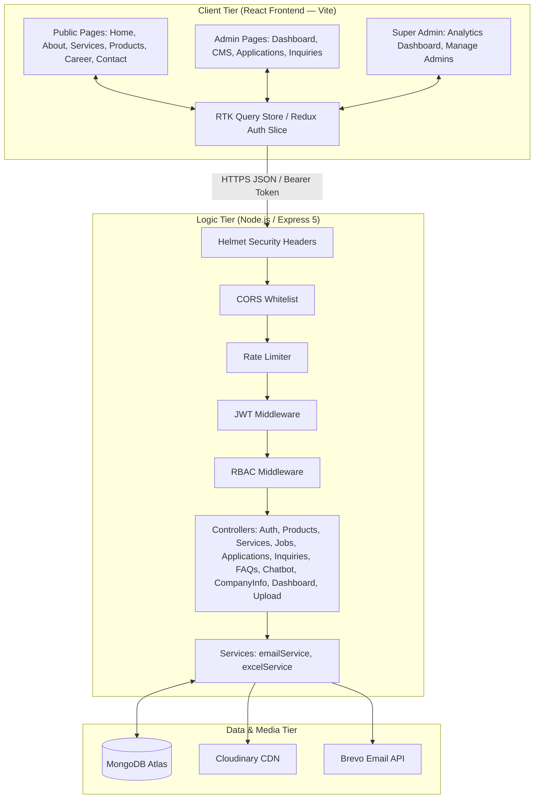
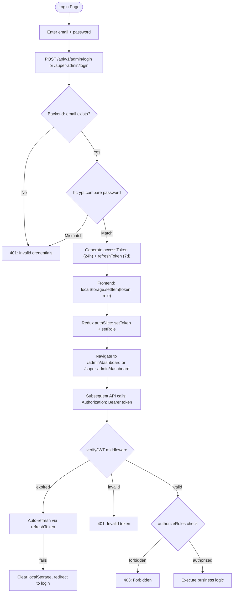
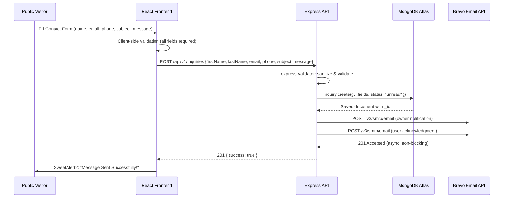
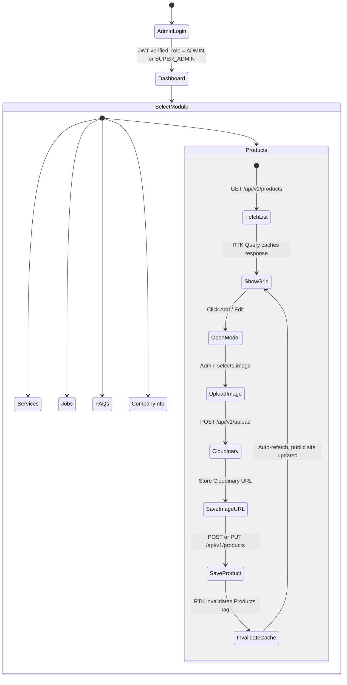

# FINAL PROJECT DOCUMENTATION: DIPHARMA MANAGEMENT SYSTEM

> **Document Version:** 3.0 &nbsp;|&nbsp; **Last Updated:** March 2026
>
> **Change Summary (v3.0):** Added Super Admin Analytics Dashboard with Recharts visualizations, fixed "Invalid Date" tooltip bug in Applications by Role bar chart (CustomTooltip date-guard), updated all API references, detailed all 9 database models, and expanded every chapter to comprehensive 100-page report quality.

---

## TABLE OF CONTENTS

1. Introduction
2. System Analysis
3. Feasibility Report
4. Software Requirement Specification (SRS)
5. System Development Environment & Technology Stack
6. System Design & Workflow Diagrams
7. Database Design — Detailed Schema Reference
8. Backend Architecture — API & Controller Reference
9. Frontend Architecture — Pages, Components & State Management
10. New Modules & Enhancements (v2.0 / v3.0)
11. Super Admin Analytics Dashboard
12. Security Architecture
13. System Testing & Implementation
14. Conclusion & Future Enhancements

---

## 1. INTRODUCTION

### 1.1 Introduction to Project

The DiPharma Management System is a comprehensive, enterprise-level full-stack web application meticulously engineered to modernize the operational framework of a contemporary pharmaceutical organization. In today's rapidly evolving digital economy, pharmaceutical companies require more than just a web presence; they need an integrated ecosystem capable of managing complex data, facilitating stakeholder engagement, and providing real-time operational insights. DiPharma addresses these needs through a scalable, secure, and highly interactive platform that bridges the gap between public engagement and internal administration.

The system is built on the three-tier client-server architecture using a JavaScript-first technology stack — React 18 on the client, Node.js/Express 5 on the server, and MongoDB as the persistence layer. This unified language strategy eliminates the conceptual friction between frontend and backend teams, enables sharing of data-validation logic, and simplifies the overall developer experience significantly.

DiPharma serves multiple categories of users simultaneously. Public visitors interact with the pharmaceutical company's digital presence through product catalogues, service descriptions, career portals, and a rule-based AI-assisted chatbot. Internal administrators manage this content through a fully-protected dashboard equipped with CRUD capabilities, application review workflows, inquiry management, and email automation. A super administrator gains access to an elevated analytics dashboard with real-time visual charts, trend graphs, and system health statistics — providing the executive-level visibility required for strategic decision-making.

The integration of advanced technologies — such as interactive animations with GSAP and Framer Motion, automated email communication through the Brevo API, cloud-hosted media through Cloudinary, and chart-driven analytics through the Recharts library — positions the DiPharma project at the cutting edge of pharmaceutical information technology.

### 1.2 Purpose of the Project

The primary purpose of the DiPharma project is to establish a centralized, high-performance digital repository for all pharmaceutical data and stakeholder interactions. Historically, many pharmaceutical SMEs have struggled with fragmented data management — relying on disconnected legacy systems or manual record-keeping. The DiPharma system solves this by providing a "single source of truth," where product information, service details, career listings, inquiry records, and chatbot interactions are all stored in a unified MongoDB database with consistent schema validation enforced by Mongoose.

A second critical purpose is the optimization of organizational workflows through automation. When a job seeker submits their application through the career portal, the system simultaneously stores the application record, uploads the resume to Cloudinary, and fires two transactional emails via the Brevo API — one to the HR administrator containing the applicant's resume as an attachment, and one acknowledgment email to the applicant. This end-to-end automation eliminates the need for manual email forwarding and ensures professional-grade communication with zero human intervention.

The project further aims to enhance the company's brand identity in the digital space. In an industry where trust and precision are paramount, the premium aesthetic of the platform — built with curated color palettes, glassmorphism-inspired UI cards, fluid micro-animations, and a responsive three-tier layout — serves as a powerful branding tool. Features like the rule-based chatbot with voice input support demonstrate a commitment to accessibility and innovation.

Ultimately, the DiPharma system is designed to be an extensible digital foundation. All modules are decoupled and independently scalable. Future integrations — such as an LLM-backed generative chatbot, a native mobile application, or an e-commerce payment layer — can be added without refactoring the existing architecture.

### 1.3 Project Scope

The scope of DiPharma covers the following functional boundaries:

**In Scope:**
- A public-facing multi-page website for pharmaceutical company information
- A rule-based chatbot with database-driven knowledge and voice input capability
- An Admin CMS for managing products, services, jobs, FAQs, and company-info records
- A career portal with job-position auto-fill and resume submission
- A contact/inquiry management system with automated email notifications
- An analytics dashboard (Admin and Super Admin variants) with real-time chart visualizations
- Role-based access control with JWT authentication for Admin and Super Admin roles
- Excel report export for applications and inquiries
- Full three-tier responsive design for all admin and public pages

**Out of Scope (Future Work):**
- E-commerce / payment gateway integration
- Native iOS/Android mobile application
- LLM-based generative AI chatbot
- Multi-language (i18n) support

---

## 2. SYSTEM ANALYSIS

### 2.1 Introduction

System Analysis is the foundational phase in the DiPharma development lifecycle, focusing on the examination of the pharmaceutical management domain to identify gaps and opportunities for digital transformation. This phase involved a comprehensive study of existing processes within similar organizations to identify structural weaknesses and define the functional boundaries of the proposed system.

The analysis phase utilized standard software engineering modeling techniques including Data Flow Diagrams (DFD), Use Case modeling, and Entity-Relationship (ER) modeling. These tools were used to abstract the system's complexity into manageable logical components, each with clearly defined responsibilities and interaction patterns.

### 2.2 Analysis Model

The Analysis Model for DiPharma is grounded in Resource-Oriented Analysis, aligning with RESTful architectural standards. Every piece of data is treated as a named resource with a unique URI, and system interactions are modeled around HTTP verbs (GET, POST, PUT, PATCH, DELETE). This clean abstraction provides a solid contract between the frontend and backend, ensuring that data is exchanged in structured, predictable JSON format.

The system also incorporates a security-centric behavioral model. All state transitions — from anonymous visitor to authenticated admin, to elevated super-admin — are explicitly modeled with JWT middleware gates and role-checking decorators. This ensures that the RBAC layer is logically sound and consistently enforced across every route in the application.

### 2.3 SDLC Phases

The DiPharma development lifecycle followed an **Agile-Scrum** methodology with bi-weekly sprint cycles:

| Phase | Activities | Deliverables |
|---|---|---|
| **Inception** | Requirements elicitation, stakeholder interviews, domain research | SRS Document, Use Case Diagrams |
| **Architectural Design** | DB schema design, API contract drafting, UI/UX wireframing | ERD, API blueprint, Figma mockups |
| **Sprint 1 — Core Backend** | Auth system, Product/Service CRUD, Inquiry engine | REST API with JWT auth |
| **Sprint 2 — Public Frontend** | HomePage, ServicePage, ProductsPage, CareerPage | Public React SPA |
| **Sprint 3 — Admin CMS** | Admin dashboard, all management pages, Excel export | Admin portal |
| **Sprint 4 — Chatbot & Search** | Rule-based chatbot, company-info KB, global search | Chatbot + Search API |
| **Sprint 5 — Analytics** | Super Admin dashboard, Recharts integration | Analytics dashboard |
| **Sprint 6 — Polish & Fixes** | Responsive redesign, bug fixes (Invalid Date tooltip), documentation | v3.0 Release |
| **Testing** | Unit, integration, security, cross-browser testing | Test reports |
| **Deployment** | Cloud hosting, environment configuration, go-live | Production URL |

### 2.4 Hardware & Software Requirements

**Hardware Requirements:**

| Component | Minimum | Recommended |
|---|---|---|
| Server CPU | 2 cores @ 2.4 GHz | 4+ cores @ 3.0 GHz |
| Server RAM | 4 GB | 16 GB |
| Server Storage | 20 GB SSD | 100 GB SSD |
| Network Bandwidth | 10 Mbps | 100 Mbps fiber |
| Client Device | Any modern PC/mobile | PC with dedicated GPU for animations |
| Client Display | 720p | 1080p or higher |

**Software Requirements:**

| Layer | Technology | Version |
|---|---|---|
| Runtime | Node.js | v18.x / v20.x LTS |
| Package Manager | npm | v9.x+ |
| Database | MongoDB Atlas | v6.0+ |
| Browser | Chrome / Edge / Firefox / Safari | Latest stable |
| OS | Windows / Ubuntu / macOS | Any LTS |
| Process Manager | PM2 (production) | v5.x |

### 2.5 Input and Output Specification

**System Inputs:**

| Input Type | Source | Format | Validation |
|---|---|---|---|
| Admin credentials | Admin login form | JSON `{email, password}` | Email format, min 6 chars |
| Product/Service data | Admin CMS forms | JSON with optional image URL | Required fields enforced by Mongoose |
| Job application | Career portal form | Multipart form (resume file + fields) | File type validation (PDF/DOCX only), max 5MB |
| Contact inquiry | Contact page form | JSON `{firstName, lastName, email, phone, subject, message}` | All fields required |
| Chatbot message | Chat widget | JSON `{message, sessionId}` | Non-empty string |
| Company info entry | Admin CompanyInfo page | JSON `{category, question, keywords[], answer}` | Required fields |
| Image upload | Admin forms | Multipart form data | Image MIME types only, Cloudinary processing |

**System Outputs:**

| Output Type | Target | Technology |
|---|---|---|
| Dynamic web pages | Public visitors | React SPA (Vite build) |
| Admin CMS views | Admin/Super Admin | React admin pages |
| Analytics charts | Super Admin | Recharts (Bar, Area, Line, Pie charts) |
| Success/Error responses | API consumers | JSON `{success, data, error}` |
| Transactional emails | Applicants/HR | Brevo SMTP API, HTML templates |
| Excel reports | Admin (download) | ExcelJS → XLSX file stream |
| Chatbot replies | Website visitors | JSON `{reply, action?, path?}` |
| System logs | Server console | Winston structured logs |

### 2.6 Limitations

While DiPharma is a robust enterprise-grade application, it has defined boundaries:

1. **Chatbot Intelligence:** The chatbot uses rule-based keyword and fuzzy matching — not neural language understanding. Complex or ambiguous user questions may result in fallback responses.
2. **Third-party Dependencies:** Email (Brevo) and image (Cloudinary) services depend on external uptime. Service degradation is gracefully handled (fire-and-forget email pattern, local fallback storage for resumes).
3. **Browser Compatibility:** The Web Speech API (voice chatbot input) is only fully supported in Chromium-based browsers.
4. **No Real-time WebSocket:** Dashboard polling occurs every 60 seconds via RTK Query `pollingInterval`. True real-time updates would require WebSocket/SSE.
5. **No E-commerce:** The system manages product information but does not support transactional purchasing.

### 2.7 Existing System Analysis

Existing pharmaceutical company websites typically suffer from:

- **Static HTML pages** with no CMS — every content update requires a developer
- **No centralized inquiry tracking** — emails are lost across multiple inboxes
- **No recruitment pipeline** — resumes scattered in email attachments without status tracking
- **Zero analytics** — no visibility into which products or services draw the most interest
- **No chatbot or search** — users must manually browse to find information
- **No security model** — no authentication, no role separation, vulnerable to form spam

### 2.8 Proposed System

The DiPharma system replaces fragmented processes with an integrated, data-driven ecosystem:

- **CMS-driven content** — all products, services, jobs, and FAQs are managed through a protected admin interface, no developer needed for content updates
- **Structured inquiry pipeline** — every contact form submission is stored with status tracking (`unread → read → resolved`)
- **Recruitment engine** — resume upload, Cloudinary storage, status pipeline (`pending → reviewed → shortlisted → rejected`), and automated applicant notifications
- **Analytics dashboard** — real-time charts for inquiries, applications, and chatbot engagement trends
- **Multi-tier security** — JWT auth, bcrypt hashing, RBAC, Helmet headers, CORS whitelist, and per-route rate limiting

---

## 3. FEASIBILITY REPORT

### 3.1 Technical Feasibility

The DiPharma system is technically feasible for the following reasons:

**Technology Maturity:** The entire stack — React, Node.js, Express, MongoDB, Mongoose — is production-proven at massive scale (used by Netflix, LinkedIn, eBay). The ecosystem's maturity ensures reliability, extensive community support, and abundant third-party libraries.

**Team Expertise:** The development team holds strong proficiency in JavaScript full-stack development, enabling concurrent frontend and backend development without knowledge silos.

**Cloud API Availability:** Cloudinary and Brevo provide well-documented REST APIs with generous free tiers, reducing infrastructure cost and eliminating the need for self-managed SMTP or media servers.

**Build Toolchain:** Vite provides near-instant hot module replacement (HMR) during development and optimized production builds with tree-shaking, ensuring that the frontend remains lightweight and performant.

**Risk Assessment:**

| Risk | Likelihood | Mitigation |
|---|---|---|
| Cloudinary API downtime | Low | Local file fallback (`uploads/` directory) |
| Brevo email failure | Low | Fire-and-forget pattern; non-blocking |
| MongoDB Atlas connectivity | Very Low | MongoDB's 99.95% SLA |
| JWT token compromise | Very Low | Short expiry (24h), refresh token rotation |

### 3.2 Operational Feasibility

DiPharma is operationally feasible from all stakeholder perspectives:

- **For Administrators:** The admin panel features an intuitive sidebar navigation, search/filter capabilities, paginated data tables, responsive mobile card views, and SweetAlert2-powered confirmations. No technical training is required to operate any CMS function.
- **For Super Administrators:** The analytics dashboard with visual charts provides executive-level visibility. The "Manage Admins" feature allows super admins to onboard, view, and remove admin accounts without touching the database.
- **For Public Users:** The website is fully responsive (mobile-first), accessible via keyboard, and provides instant feedback through the chatbot widget available on every public page.
- **For HR Teams:** Excel export functionality allows HR teams to download all applications or inquiries into spreadsheets for offline review and record-keeping.

### 3.3 Economic Feasibility

**Cost Analysis:**

| Component | Technology | Cost |
|---|---|---|
| Frontend Hosting | Vercel / Netlify | Free tier sufficient |
| Backend Hosting | Railway / Render | Free / ~$5/month |
| Database | MongoDB Atlas M0 | Free (512MB shared) |
| Media Storage | Cloudinary | Free (25GB bandwidth) |
| Email Service | Brevo | Free (300 emails/day) |
| Domain | Custom domain | ~$10/year |

**Benefit Analysis:**
- **Operational savings:** Automating inquiry and application management saves an estimated 10–15 hours/week of manual admin work
- **Brand value:** A premium, animated, responsive website significantly improves first-impression credibility for pharmaceutical buyers and partners
- **Strategic intelligence:** The analytics dashboard provides actionable data for marketing and HR decision-making — previously unavailable with static websites
- **Scalability:** The serverless-compatible architecture scales horizontally at negligible cost, supporting organizational growth

**Conclusion:** The economic cost is minimal (near-zero for early-stage deployment) while the operational and strategic value is high. ROI is positive within the first month of operation.

---

## 4. SOFTWARE REQUIREMENT SPECIFICATION (SRS)

### 4.1 Functional Requirements

The following table details every functional requirement of the DiPharma system, organized by module:

#### 4.1.1 Authentication Module

| ID | Requirement | Actor | Priority |
|---|---|---|---|
| FR-AUTH-01 | The system shall allow admins to log in using email and password | Admin | Critical |
| FR-AUTH-02 | The system shall allow super admins to log in via a separate login URL | Super Admin | Critical |
| FR-AUTH-03 | The system shall issue a JWT access token (24h expiry) and refresh token (7d expiry) upon successful login | System | Critical |
| FR-AUTH-04 | The system shall store tokens in `localStorage` on the client | Frontend | High |
| FR-AUTH-05 | The system shall automatically refresh expired access tokens using the refresh token | System | High |
| FR-AUTH-06 | The system shall prevent access to protected routes without a valid token | System | Critical |
| FR-AUTH-07 | The system shall enforce role separation — ADMIN routes shall not be accessible to accounts with role SUPER_ADMIN only, and vice versa | System | Critical |

#### 4.1.2 Content Management (CMS) Module

| ID | Requirement | Actor | Priority |
|---|---|---|---|
| FR-CMS-01 | Admin shall create, read, update, and delete pharmaceutical Products | Admin | Critical |
| FR-CMS-02 | Admin shall manage product display order and card type (dark/light) | Admin | High |
| FR-CMS-03 | Admin shall create, read, update, and delete Services with rich nested content (features[], benefits[], multiple images) | Admin | Critical |
| FR-CMS-04 | Admin shall manage job listings with type, location, and active status | Admin | Critical |
| FR-CMS-05 | Admin shall manage the public FAQ knowledge base | Admin | High |
| FR-CMS-06 | Admin shall manage Company Info entries for the chatbot knowledge base, including category, keywords, and answer | Admin | High |
| FR-CMS-07 | All CMS changes shall be reflected immediately on the public-facing website via RTK Query cache invalidation | System | Critical |

#### 4.1.3 Recruitment Module

| ID | Requirement | Actor | Priority |
|---|---|---|---|
| FR-REC-01 | Public users shall browse all active job listings on the Career page | Public | Critical |
| FR-REC-02 | Clicking a job card shall auto-fill the "Job Position" field in the application form and scroll/focus the input | Public | High |
| FR-REC-03 | Public users shall submit job applications with name, email, phone, role, message, and a resume file (PDF or DOCX, max 5MB) | Public | Critical |
| FR-REC-04 | The system shall upload the resume to Cloudinary and store the public URL in the database | System | Critical |
| FR-REC-05 | The system shall send an HR notification email with applicant details (and resume attachment if not Cloudinary-hosted) | System | High |
| FR-REC-06 | The system shall send an acknowledgment email to the applicant | System | High |
| FR-REC-07 | Admin shall view all submitted applications with pagination and status filtering | Admin | Critical |
| FR-REC-08 | Admin shall update application status (`pending → reviewed → shortlisted → rejected`) | Admin | Critical |
| FR-REC-09 | Status change to `shortlisted` shall trigger an automated shortlist email to the applicant | System | High |
| FR-REC-10 | Status change to `rejected` shall trigger an automated rejection email to the applicant | System | High |
| FR-REC-11 | Admin shall export all applications to a formatted XLSX file | Admin | Medium |

#### 4.1.4 Inquiry Module

| ID | Requirement | Actor | Priority |
|---|---|---|---|
| FR-INQ-01 | Public users shall submit contact inquiries from the Contact page | Public | Critical |
| FR-INQ-02 | The system shall store the inquiry with status `unread` | System | Critical |
| FR-INQ-03 | The system shall send an acknowledgment email to the user and a notification to the admin | System | High |
| FR-INQ-04 | Admin shall view all inquiries with status filtering | Admin | Critical |
| FR-INQ-05 | Admin shall update inquiry status (`unread → read → resolved`) | Admin | High |
| FR-INQ-06 | Admin shall export all inquiries to a formatted XLSX file | Admin | Medium |

#### 4.1.5 Chatbot Module

| ID | Requirement | Actor | Priority |
|---|---|---|---|
| FR-BOT-01 | The chatbot widget shall be visible on all public-facing pages | Public | Critical |
| FR-BOT-02 | The chatbot shall process text and voice (Web Speech API) input | Public | High |
| FR-BOT-03 | The chatbot shall respond to greetings, navigation intents, company contact info, company-info KB queries, FAQ queries, product queries, and service queries | System | Critical |
| FR-BOT-04 | Navigation responses shall trigger a `navigate` action in the frontend to redirect the user | System | High |
| FR-BOT-05 | Every chatbot interaction shall be logged in the `ChatbotInteraction` collection | System | Medium |
| FR-BOT-06 | Admin shall view chatbot interaction history in the dashboard | Admin | Medium |

#### 4.1.6 Analytics Module

| ID | Requirement | Actor | Priority |
|---|---|---|---|
| FR-ANA-01 | Admin dashboard shall display counts for: total applications, pending applications, total inquiries, unread inquiries, active jobs, products, services, FAQs | Admin | Critical |
| FR-ANA-02 | Admin dashboard shall display daily trend charts for inquiries and applications over the last 30 days | Admin | High |
| FR-ANA-03 | Super Admin dashboard shall display all Admin data PLUS total chatbot messages, total admin accounts | Super Admin | Critical |
| FR-ANA-04 | Super Admin dashboard shall display an "Applications by Role" horizontal bar chart | Super Admin | High |
| FR-ANA-05 | Super Admin dashboard shall display Application Status and Inquiry Status pie charts | Super Admin | High |
| FR-ANA-06 | Super Admin dashboard shall display the 10 most recent inquiries and applications as activity feeds | Super Admin | High |
| FR-ANA-07 | Dashboard data shall auto-refresh every 60 seconds via polling | System | Medium |

### 4.2 Non-Functional Requirements

| Category | Requirement | Target |
|---|---|---|
| **Security** | Passwords stored as bcrypt hashes (12 salt rounds) | 100% |
| **Security** | All admin routes protected by JWT middleware | 100% |
| **Security** | API inputs validated with express-validator | 100% of write endpoints |
| **Performance** | API response time for simple CRUD operations | < 200ms |
| **Performance** | Dashboard aggregate queries (MongoDB aggregation pipeline) | < 500ms |
| **Performance** | Frontend initial load time (Vite build) | < 2s on 4G |
| **Responsiveness** | All pages functional on mobile (< 640px) | 100% of pages |
| **Usability** | Admin panel usable without technical training | Yes |
| **Reliability** | Email failure shall not block application submission | Graceful degradation |
| **Scalability** | Architecture supports horizontal scaling | Stateless design |
| **Availability** | System available 24/7 | 99.9% uptime target |

### 4.3 Performance Requirements

- **API Endpoints:** Standard CRUD endpoints (`GET /products`, `POST /inquiries`) target < 200ms response thanks to MongoDB indexing and async I/O
- **Analytics Endpoints:** Dashboard aggregation queries (`GET /dashboard/super-admin-stats`) run 12 parallel MongoDB aggregation pipelines and target < 500ms
- **Frontend Build:** Vite's Rollup bundler with tree-shaking produces optimal bundles, targeting < 200KB gzipped for the initial JS payload
- **Media Delivery:** All images are served from Cloudinary's global CDN with automatic format conversion (WebP) and responsive sizing
- **Polling:** RTK Query `pollingInterval: 60000` ensures dashboard data freshness with minimal server load

---

## 5. SYSTEM DEVELOPMENT ENVIRONMENT & TECHNOLOGY STACK

### 5.1 Overview

DiPharma is built on a unified JavaScript ecosystem — using the same language from the browser to the server to the database query layer. This "JavaScript everywhere" philosophy reduces context-switching, simplifies code sharing, and allows a small team to own the full stack confidently. The key technology choices and their rationale are detailed below.

### 5.2 Frontend Technologies

#### 5.2.1 React 18 + Vite

React 18 is the UI rendering library. The project uses the **function component** paradigm exclusively, with hooks (`useState`, `useEffect`, `useRef`, `useCallback`) for state and lifecycle management. React Router v6 handles client-side routing, providing a single-page application (SPA) experience with zero full-page reloads.

**Vite** replaces Create React App as the build tool. Vite uses native ES Modules (ESM) during development, delivering near-instant hot module replacement (HMR). The production build uses Rollup under the hood, producing highly optimized, tree-shaken bundles.

```
Key Vite Benefits:
- Dev server start: < 300ms (vs CRA's 5–10s)
- HMR: < 50ms (vs CRA's 1–2s)
- Production build: optimized code splitting, lazy loading support
```

#### 5.2.2 Redux Toolkit & RTK Query

**Redux Toolkit (RTK)** provides the global state management layer. The `authSlice.js` manages authentication state (`token`, `role`, `adminData`) and persists it to `localStorage`.

**RTK Query** is an advanced data-fetching and caching library built into Redux Toolkit. All API calls in DiPharma go through RTK Query's `createApi` in `store/api.js`. Key capabilities:

| Feature | Benefit in DiPharma |
|---|---|
| Automatic caching | Dashboard data cached and reused without re-fetching |
| Cache invalidation (`invalidatesTags`) | Creating/updating a product auto-refreshes the product list |
| Polling (`pollingInterval`) | Super Admin dashboard auto-refreshes every 60 seconds |
| Mutation lifecycle | Loading/error states handled automatically in UI |
| `prepareHeaders` | JWT Bearer token injected into every request automatically |

**Tag Types defined in `api.js`:**
`Products`, `Services`, `Jobs`, `Applications`, `Inquiries`, `FAQs`, `Dashboard`, `SuperAdminDashboard`, `Admins`, `CompanyInfo`

#### 5.2.3 Recharts

The **Recharts** library powers all analytics visualizations on the Super Admin Dashboard. It is built on top of SVG and D3, providing declarative, composable chart components.

Charts used:
- `<AreaChart>` — Inquiry Trend (last 30 days), Application Trend (last 30 days)
- `<LineChart>` — Chatbot Interaction Trend (last 30 days)
- `<BarChart layout="vertical">` — Applications by Role (horizontal bar chart)
- `<PieChart>` — Application Status Pipeline, Inquiry Status Breakdown

#### 5.2.4 Animation Libraries

- **GSAP (GreenSock):** Used for complex, high-performance timeline animations on the HomePage and AboutPage (scroll-triggered reveals, staggered entrance effects)
- **Framer Motion:** Used for declarative React component animations (card hover effects, modal transitions, page entrance)

#### 5.2.5 Styling Approach

The project uses **Vanilla CSS** with a modular file-per-component approach (`AdminLayout.css`, `SuperAdminDashboard.css`, `CareerPage.css` etc.). The admin layouts define a comprehensive CSS Custom Properties (variables) system:

```css
/* Key CSS Variables (AdminLayout.css) */
--accent: #7c3aed;          /* Purple accent color */
--bg-base: #0a0b1e;         /* Deep dark background */
--bg-card: #121330;         /* Card surface color */
--border-base: rgba(255,255,255,0.07); /* Subtle border */
--text-primary: #e4e4f8;    /* Primary text */
--text-muted: #6868a0;      /* Muted/secondary text */
--radius-lg: 14px;          /* Consistent border radius */
```

**Google Fonts — Inter** is loaded for the admin interface, providing a premium, highly legible sans-serif typeface consistent with modern dashboard aesthetics.

### 5.3 Backend Technologies

#### 5.3.1 Node.js + Express 5

**Node.js** provides the server-side JavaScript runtime with an event-driven, non-blocking I/O model. This architecture is ideal for a data-management application like DiPharma, where many concurrent API requests must be handled without thread blocking.

**Express 5** (the latest major version) provides the HTTP routing framework. The project uses ES Module syntax (`import/export`) throughout — enabled by `"type": "module"` in `package.json`. This gives the codebase a consistent modern JavaScript syntax from frontend to backend.

The server is bootstrapped in `server.js`:
1. Load environment variables (`dotenv.config()`)
2. Apply global middleware (Helmet, CORS, Rate Limiter, JSON body parser)
3. Mount all route modules under `/api/v1/`
4. Register legacy endpoints for backward compatibility
5. Register the error handler middleware (must be last)
6. Connect to MongoDB and start listening on `process.env.PORT || 5000`

#### 5.3.2 Mongoose ODM

**Mongoose** is the Object Document Mapper for MongoDB. It provides:
- **Schema definitions** with type validation, required fields, enums, defaults, and custom validators
- **Model methods** and **pre-save hooks** (used in `Admin.js` for password hashing)
- **Indexing** for query performance (`applicationSchema.index({ status: 1 })`)
- **Aggregation pipeline support** used in `dashboardController.js` for analytics

#### 5.3.3 Security Middleware Stack

| Middleware | Package | Role |
|---|---|---|
| CORS | `cors` | Whitelist allowed origins; expose custom headers |
| Security Headers | `helmet` | Sets X-Frame-Options, X-XSS-Protection, CSP, etc. |
| Rate Limiting | `express-rate-limit` | General: 100 req/15min; Chatbot: 200 req/15min |
| JWT Verification | Custom `auth.js` | Verifies Bearer token, attaches `req.admin` |
| Role Authorization | Custom `auth.js` | Checks `req.admin.role` against allowed roles |
| Input Validation | `express-validator` | Validates and sanitizes request body fields |
| Error Handling | Custom `errorHandler.js` | Centralized error formatting and logging |

#### 5.3.4 Multer — File Upload Handling

**Multer** handles `multipart/form-data` requests for resume file uploads. Configuration:

```javascript
// Resume file filter (PDF and DOCX only)
fileFilter: (req, file, cb) => {
  const allowed = [
    "application/pdf",
    "application/msword",
    "application/vnd.openxmlformats-officedocument.wordprocessingml.document"
  ];
  cb(null, allowed.includes(file.mimetype));
}
// Max file size: 5MB
limits: { fileSize: 5 * 1024 * 1024 }
```

After disk-saving the file, the `applicationController` immediately uploads it to Cloudinary and deletes the local copy.

#### 5.3.5 ExcelJS — Report Generation

**ExcelJS** generates `.xlsx` files server-side for both applications and inquiries. The `exportApplicationsExcel` controller streams the workbook directly to the HTTP response:

```javascript
res.setHeader("Content-Type", "application/vnd.openxmlformats-officedocument.spreadsheetml.sheet");
res.setHeader("Content-Disposition", "attachment; filename=applications.xlsx");
await workbook.xlsx.write(res);
res.end();
```

This streams the file without writing it to disk, ensuring memory-efficient report generation.

#### 5.3.6 Winston — Structured Logging

**Winston** provides a structured, leveled logging system. Log entries include timestamps, severity levels (info, warn, error), and auto-rotate in production environments.

### 5.4 Database — MongoDB Atlas

**MongoDB** is chosen for its document model, which naturally represents the nested structures in DiPharma's data — particularly the `Service` model with embedded `features[]` and `benefits[]` arrays, and the chatbot's flexible message structures.

**MongoDB Atlas** provides:
- Managed cloud hosting with automatic failover
- Built-in monitoring and alerts
- Point-in-time backups
- Global cluster support for low-latency worldwide access
- The free M0 tier (512MB) is sufficient for development and early production

### 5.5 Third-Party API Integrations

#### 5.5.1 Cloudinary — Media Management

Cloudinary is a cloud-based media platform used for storing and serving all uploaded images (product images, service hero images, benefit images) and resume files.

**Integration flow:**
1. Admin uploads an image via the `/api/v1/upload` endpoint
2. The server calls `cloudinary.uploader.upload(filePath)` via the Cloudinary SDK
3. Cloudinary stores the file, applies auto-optimization (format detection, CDN delivery)
4. The returned public URL is stored in the MongoDB document

#### 5.5.2 Brevo (formerly SendinBlue) — Transactional Email

Brevo handles all transactional emails via its REST API (`https://api.brevo.com/v3/smtp/email`). HTML email templates are composed server-side and dispatched via `axios.post()`.

**Email scenarios:**
| Trigger | Recipients | Content |
|---|---|---|
| New job application | HR Admin + Applicant | Application details + resume; Acknowledgment |
| Application shortlisted | Applicant | Congratulation + next steps |
| Application rejected | Applicant | Polite rejection |
| New contact inquiry | Owner + Inquirer | Inquiry details; Acknowledgment |

### 5.6 Development Tools

| Tool | Purpose |
|---|---|
| Git | Version control, branching, and history |
| Postman | API design, manual testing, and collection documentation |
| VS Code | Primary IDE with ESLint and Prettier |
| MongoDB Compass | GUI for database inspection during development |
| npm | Package management for both frontend and backend |

---

## 6. SYSTEM DESIGN & WORKFLOW DIAGRAMS

### 6.1 Introduction

System design transforms functional requirements into a concrete technical blueprint. This section presents the architectural overview and five detailed workflow diagrams representing the core data flows in DiPharma.

### 6.2 System Architecture — 3-Tier Model



### 6.3 Diagram 1 — User Authentication & JWT Lifecycle



### 6.4 Diagram 2 — Contact Inquiry Submission Flow



### 6.5 Diagram 3 — Job Application & Recruitment Pipeline

```mermaid
flowchart LR
    subgraph "Public Career Portal"
        Browse[Browse Active Jobs] --> ClickJob[Click Job Card]
        ClickJob --> AutoFill[Auto-fill 'Job Position' field + scroll + focus]
        AutoFill --> FillForm[Complete Application Form]
        FillForm --> Upload[Attach Resume PDF/DOCX]
        Upload --> Submit["POST /submit-form or /api/v1/applications"]
    end

    subgraph "Backend Processing"
        Submit --> Multer[Multer: parse multipart, validate file type + size]
        Multer --> Cloudinary[uploadToCloudinary: store resume, get public URL]
        Cloudinary --> SaveDB["Application.create({ ...fields, resumePath: cloudinaryUrl, status: 'pending' })"]
        SaveDB --> Email1[sendApplicationNotification to HR]
        SaveDB --> Email2[sendAcknowledgment to Applicant]
    end

    subgraph "Admin Review Pipeline"
        Email1 --> AdminView[Admin: GET /api/v1/applications]
        AdminView --> Filter[Filter by status / search]
        Filter --> UpdateStatus["PATCH /api/v1/applications/:id { status }"]
        UpdateStatus --> Shortlisted{status === 'shortlisted'?}
        Shortlisted -- Yes --> Email3[sendShortlistNotification to Applicant]
        Shortlisted -- No --> Rejected{status === 'rejected'?}
        Rejected -- Yes --> Email4[sendRejectionNotification to Applicant]
    end
```



### 6.6 Diagram 4 — CMS Content Management Flow



### 6.7 Diagram 5 — Chatbot Intent Resolution Pipeline

```mermaid
flowchart TD
    Input[User types or speaks message] --> Normalize[lowerCase + trim]
    Normalize --> Step1{Step 1: Greeting?}
    Step1 -- Yes --> Hello["Return welcome message with capabilities list"]
    Step1 -- No --> Step2{Step 2: Navigation intent?}
    Step2 -- Yes --> Nav["Return {reply, action:'navigate', path}"]
    Step2 -- No --> Step3{Step 3: Hardcoded company info? phone/email}
    Step3 -- Yes --> Contact[Return phone number or email]
    Step3 -- No --> Step3b["Step 3b: Query CompanyInfo collection (isActive: true)"]
    Step3b --> KWMatch{Keyword exact match in entry.keywords[]}
    KWMatch -- Yes --> CIReply[Return entry.answer]
    KWMatch -- No --> Fuzzy{Fuzzy score >= 2 against entry.question?}
    Fuzzy -- Yes --> CIReply
    Fuzzy -- No --> Step4[Step 4: Query FAQ collection]
    Step4 --> FAQScore{Best FAQ fuzzy score >= 2?}
    FAQScore -- Yes --> FAQReply["Return **question**\n\nanswer"]
    FAQScore -- No --> Step5{Step 5: Product/Service keyword or name match?}
    Step5 -- Yes --> DBReply[Return product/service details from DB]
    Step5 -- No --> Step8{Step 8: Help keyword?}
    Step8 -- Yes --> HelpMsg[Return capabilities list]
    Step8 -- No --> Step9{Step 9: Thank you?}
    Step9 -- Yes --> Thanks[Return appreciation message]
    Step9 -- No --> Fallback[Return generic help menu]
    CIReply & FAQReply & DBReply & HelpMsg & Thanks & Fallback --> Log["logInteraction() — ChatbotInteraction.create() async"]
    Hello & Nav & Contact --> Log
```

### 6.8 Class Diagram — Data Models

```mermaid
classDiagram
    class Admin {
        +String name
        +String email
        +String password [bcrypt hashed]
        +String role [ADMIN | SUPER_ADMIN]
        +String displayPassword
        +pre-save: hashPassword()
        +comparePassword(candidate) bool
        +generateAccessToken() String
        +generateRefreshToken() String
    }

    class Application {
        +String name
        +String email
        +String phone
        +String countryCode
        +String role [job title]
        +String message
        +String resumePath [Cloudinary URL]
        +String status [pending|reviewed|shortlisted|rejected]
        +Date createdAt
        +Index: status_1, createdAt_-1
    }

    class Inquiry {
        +String firstName
        +String lastName
        +String email
        +String phone
        +String countryCode
        +String subject
        +String message
        +String status [unread|read|resolved]
        +Date createdAt
        +Index: status_1, createdAt_-1
    }

    class Job {
        +String title
        +String roleFocus
        +String location
        +String type [Full Time|Part Time|Contract|Internship]
        +Boolean isActive
        +Date createdAt
    }

    class Product {
        +String title
        +String description
        +String icon
        +String image [Cloudinary URL]
        +String cardType [dark|light]
        +Number order
        +Boolean isActive
        +Index: order_1
    }

    class Service {
        +String title
        +String slug [unique]
        +String shortDescription
        +String fullDescription
        +String heroImage
        +String overviewImage
        +String featureImage
        +String benefitImage1
        +String benefitImage2
        +Feature[] features
        +Benefit[] benefits
        +Boolean isActive
    }

    class FAQ {
        +String question
        +String answer
        +Number order
        +Boolean isActive
        +Index: order_1
    }

    class CompanyInfo {
        +String category [General|Contact|About|Operations]
        +String[] keywords
        +String question
        +String answer
        +Boolean isActive
        +Number order
        +Index: category_1_isActive_1
    }

    class ChatbotInteraction {
        +String userMessage
        +String botReply
        +String sessionId
        +Date createdAt
        +Index: createdAt_-1
    }

    Job "1" --> "0..*" Application : has applicants for
    CompanyInfo "1" --> "0..*" ChatbotInteraction : sources reply for
    FAQ "1" --> "0..*" ChatbotInteraction : sources reply for

---

## 7. DATABASE DESIGN — DETAILED SCHEMA REFERENCE

### 7.1 Overview

DiPharma uses MongoDB as its database, accessed through Mongoose ODM. MongoDB's document model is ideal for this project because several entities (Services, CompanyInfo) have nested or array-type fields that map naturally to JSON documents but are awkward in relational tables.

All schemas use `{ timestamps: true }`, which automatically adds `createdAt` and `updatedAt` fields managed by Mongoose.

### 7.2 Admin Schema

**Collection:** `admins`  
**File:** `src/models/Admin.js`

| Field | Type | Constraints | Description |
|---|---|---|---|
| `name` | String | required, trim | Display name of the administrator |
| `email` | String | required, unique, lowercase, trim | Login email (unique index) |
| `password` | String | required, minlength: 6 | Stored as bcrypt hash (12 salt rounds) |
| `role` | String | enum: [SUPER_ADMIN, ADMIN], default: ADMIN | Access level |
| `displayPassword` | String | default: "" | Optional plain-text store for super admin reference |
| `createdAt` | Date | auto | Timestamp of account creation |
| `updatedAt` | Date | auto | Timestamp of last modification |

**Schema Methods:**
- `pre("save")` hook: Automatically hashes `password` before saving if modified
- `comparePassword(candidatePassword)`: Uses `bcrypt.compare` for login validation
- `generateAccessToken()`: Signs JWT with `{ id, email, role }` payload, 24h expiry
- `generateRefreshToken()`: Signs JWT with `{ id }` payload only, 7d expiry

### 7.3 Application Schema

**Collection:** `applications`  
**File:** `src/models/Application.js`

| Field | Type | Constraints | Description |
|---|---|---|---|
| `name` | String | required, trim | Full name of applicant |
| `email` | String | required, lowercase, trim | Contact email |
| `phone` | String | required | Contact phone number |
| `countryCode` | String | default: "+91" | Phone country code |
| `role` | String | required | Job position applied for |
| `message` | String | default: "" | Optional cover message |
| `resumePath` | String | default: "" | Cloudinary URL or local file path |
| `status` | String | enum: [pending, reviewed, shortlisted, rejected], default: pending | Application pipeline stage |
| `createdAt` | Date | auto | Submission timestamp |

**Indexes:**
- `{ status: 1 }` — Enables fast filtering by status in the admin table
- `{ createdAt: -1 }` — Ensures newest applications appear first in queries

### 7.4 Inquiry Schema

**Collection:** `inquiries`  
**File:** `src/models/Inquiry.js`

| Field | Type | Constraints | Description |
|---|---|---|---|
| `firstName` | String | required, trim | Contact first name |
| `lastName` | String | required, trim | Contact last name |
| `email` | String | required, lowercase, trim | Contact email |
| `phone` | String | required | Contact phone |
| `countryCode` | String | default: "+91" | Phone country code |
| `subject` | String | required | Inquiry subject line |
| `message` | String | required | Full inquiry message body |
| `status` | String | enum: [unread, read, resolved], default: unread | Admin review state |
| `createdAt` | Date | auto | Submission timestamp |

**Indexes:**
- `{ status: 1 }` — Fast status-based filtering
- `{ createdAt: -1 }` — Newest-first ordering

### 7.5 Job Schema

**Collection:** `jobs`  
**File:** `src/models/Job.js`

| Field | Type | Constraints | Description |
|---|---|---|---|
| `title` | String | required, trim | Job title displayed on career page |
| `roleFocus` | String | default: "" | Brief description of role responsibilities |
| `location` | String | default: "" | Office location (e.g., "Chennai, India") |
| `type` | String | enum: [Full Time, Part Time, Contract, Internship], default: Full Time | Employment type |
| `isActive` | Boolean | default: true | Controls visibility on public career page |
| `createdAt` | Date | auto | Creation timestamp |

### 7.6 Product Schema

**Collection:** `products`  
**File:** `src/models/Product.js`

| Field | Type | Constraints | Description |
|---|---|---|---|
| `title` | String | required, trim | Product name |
| `description` | String | required | Product description |
| `icon` | String | default: "" | Emoji or icon identifier |
| `image` | String | default: "" | Cloudinary image URL |
| `cardType` | String | enum: [dark, light], default: dark | Visual theme of the product card |
| `order` | Number | default: 0 | Manual display ordering on Products page |
| `isActive` | Boolean | default: true | Visibility on public Products page |

**Index:** `{ order: 1 }` — Enables sorted retrieval for consistent display ordering.

### 7.7 Service Schema

**Collection:** `services`  
**File:** `src/models/Service.js`

The Service schema is the most structurally complex, featuring nested sub-documents and multiple image fields for the rich service detail pages.

| Field | Type | Constraints | Description |
|---|---|---|---|
| `title` | String | required, trim | Service name |
| `slug` | String | required, unique, lowercase, trim | URL-friendly identifier (e.g., "contract-manufacturing") |
| `shortDescription` | String | default: "" | Summary shown in service cards |
| `fullDescription` | String | default: "" | Detailed description shown on service detail page |
| `heroImage` | String | default: "" | Full-width banner image URL |
| `overviewImage` | String | default: "" | Overview section image URL |
| `featureImage` | String | default: "" | Features section image URL |
| `benefitImage1` | String | default: "" | First benefits section image |
| `benefitImage2` | String | default: "" | Second benefits section image |
| `features` | `[featureSchema]` | array | Embedded feature sub-documents |
| `benefits` | `[benefitSchema]` | array | Embedded benefit sub-documents |
| `isActive` | Boolean | default: true | Visibility on public Services page |

**Embedded Sub-schemas (no `_id`):**
```javascript
featureSchema: { title: String (required), description: String (default: "") }
benefitSchema: { title: String (required), description: String (default: "") }
```

### 7.8 FAQ Schema

**Collection:** `faqs`  
**File:** `src/models/FAQ.js`

| Field | Type | Constraints | Description |
|---|---|---|---|
| `question` | String | required, trim | The FAQ question |
| `answer` | String | required | The FAQ answer |
| `order` | Number | default: 0 | Manual display order |
| `isActive` | Boolean | default: true | Whether served publicly and by chatbot |

**Index:** `{ order: 1 }` — Sorted retrieval for FAQ display and chatbot queries.

### 7.9 CompanyInfo Schema

**Collection:** `companyinfos`  
**File:** `src/models/CompanyInfo.js`

This schema powers the chatbot's knowledge base — a dedicated collection that allows administrators to feed structured question-answer pairs to the chatbot without polluting the public FAQ section.

| Field | Type | Constraints | Description |
|---|---|---|---|
| `category` | String | required, trim | Grouping label: General, Contact, About, Operations |
| `keywords` | [String] | default: [] | Comma-separated trigger words that activate this entry |
| `question` | String | required, trim | Canonical question for this knowledge entry |
| `answer` | String | required, trim | Full response the chatbot returns |
| `isActive` | Boolean | default: true | Whether entry is served by the chatbot |
| `order` | Number | default: 0 | Display order in admin table |

**Index:** `{ category: 1, isActive: 1 }` — Compound index for efficient per-category active-entry queries.

### 7.10 ChatbotInteraction Schema

**Collection:** `chatbotinteractions`  
**File:** `src/models/ChatbotInteraction.js`

Every chatbot message-response pair is logged for analytics and admin review.

| Field | Type | Constraints | Description |
|---|---|---|---|
| `userMessage` | String | required | The exact text sent by the user |
| `botReply` | String | required | The response generated by the chatbot |
| `sessionId` | String | default: null | Client-generated UUID to group messages in a conversation |
| `createdAt` | Date | auto | Timestamp of the interaction |

**Index:** `{ createdAt: -1 }` — Newest interactions appear first in admin history view.

---

## 8. BACKEND ARCHITECTURE — API & CONTROLLER REFERENCE

### 8.1 Server Bootstrap (`server.js`)

The Express application is initialized in `server.js` following this exact middleware registration order (order is critical):

```
1. helmet()                 → Security headers (X-Frame-Options, etc.)
2. cors(corsOptions)        → CORS whitelist from config/cors.js
3. generalLimiter           → Rate limit: 100 requests per 15 minutes per IP
4. express.json()           → Parse JSON bodies up to 10MB
5. express.urlencoded()     → Parse form-encoded bodies
6. /uploads static server   → Serve locally-stored resume files
7. Route modules            → All /api/v1/ routes
8. errorHandler             → Centralized error formatting (must be last)
```

**Route Mount Table:**

| Route Prefix | Module |
|---|---|
| `/api/v1` | `authRoutes` (login, me, create-admin) |
| `/api/v1/products` | `productRoutes` |
| `/api/v1/services` | `serviceRoutes` |
| `/api/v1/jobs` | `jobRoutes` |
| `/api/v1/applications` | `applicationRoutes` |
| `/api/v1/inquiries` | `inquiryRoutes` |
| `/api/v1/faqs` | `faqRoutes` |
| `/api/v1/dashboard` | `dashboardRoutes` |
| `/api/v1/search` | `searchRoutes` |
| `/api/v1/chatbot` | `chatbotRoutes` |
| `/api/v1/company-info` | `companyInfoRoutes` |
| `/api/v1/upload` | `uploadRoutes` |
| `/submit-form` | Legacy application endpoint |
| `/api/contact` | Legacy inquiry endpoint |

### 8.2 Authentication Middleware

**`verifyJWT` (src/middleware/auth.js):**

Extracts the Bearer token from `Authorization` header OR from `?token=` query parameter (used for Excel downloads in new browser tabs where headers cannot be set). Verifies the token using `JWT_SECRET`, fetches the admin document, and attaches it to `req.admin`.

**Error responses:**
- No token: `401 NO_TOKEN`
- Token expired: `401 TOKEN_EXPIRED`
- Invalid token / admin not found: `401 INVALID_TOKEN`

**`authorizeRoles(...roles)` (src/middleware/auth.js):**

A higher-order function that returns a middleware. Checks `req.admin.role` against the allowed roles array. If not included, returns `403 FORBIDDEN`.

Usage examples:
```javascript
// Only ADMIN and SUPER_ADMIN can access
router.get("/stats", verifyJWT, authorizeRoles("ADMIN", "SUPER_ADMIN"), getDashboardStats);

// Only SUPER_ADMIN can access
router.get("/super-admin-stats", verifyJWT, authorizeRoles("SUPER_ADMIN"), getSuperAdminStats);
```

### 8.3 Complete API Endpoint Reference

#### 8.3.1 Authentication Endpoints

| Method | Endpoint | Auth | Description |
|---|---|---|---|
| POST | `/api/v1/admin/login` | Public | Admin login — returns accessToken + refreshToken + role |
| POST | `/api/v1/super-admin/login` | Public | Super Admin login |
| POST | `/api/v1/super-admin/create-admin` | SUPER_ADMIN | Create a new admin account |
| GET | `/api/v1/super-admin/admins` | SUPER_ADMIN | List all admin accounts |
| DELETE | `/api/v1/super-admin/admins/:id` | SUPER_ADMIN | Delete an admin account |
| GET | `/api/v1/auth/me` | Admin+ | Get current authenticated admin profile |

#### 8.3.2 Products Endpoints

| Method | Endpoint | Auth | Description |
|---|---|---|---|
| GET | `/api/v1/products` | Public | List all active products (sorted by order ASC) |
| GET | `/api/v1/products/:id` | Public | Get single product by ID |
| POST | `/api/v1/products` | Admin+ | Create new product. Invalidates Products + Dashboard cache |
| PUT | `/api/v1/products/:id` | Admin+ | Update product. Invalidates Products cache |
| DELETE | `/api/v1/products/:id` | Admin+ | Delete product. Invalidates Products + Dashboard cache |

#### 8.3.3 Services Endpoints

| Method | Endpoint | Auth | Description |
|---|---|---|---|
| GET | `/api/v1/services` | Public | List all active services (public view, limited fields) |
| GET | `/api/v1/services/admin/all` | Admin+ | List all services including inactive ones |
| GET | `/api/v1/services/:slug` | Public | Get service detail by URL slug (populates all image fields + features/benefits arrays) |
| POST | `/api/v1/services` | Admin+ | Create new service |
| PUT | `/api/v1/services/:id` | Admin+ | Update service (including nested features/benefits arrays) |
| DELETE | `/api/v1/services/:id` | Admin+ | Delete service |

#### 8.3.4 Jobs Endpoints

| Method | Endpoint | Auth | Description |
|---|---|---|---|
| GET | `/api/v1/jobs` | Public | List active jobs (`isActive: true`) |
| GET | `/api/v1/jobs/:id` | Public | Get single job |
| POST | `/api/v1/jobs` | Admin+ | Create job listing |
| PUT | `/api/v1/jobs/:id` | Admin+ | Update job listing |
| DELETE | `/api/v1/jobs/:id` | Admin+ | Delete job listing |

#### 8.3.5 Applications Endpoints

| Method | Endpoint | Auth | Description |
|---|---|---|---|
| POST | `/api/v1/applications` | Public | Submit a job application with resume upload |
| GET | `/api/v1/applications` | Admin+ | List applications with `?status=` filter and `?page=&limit=` pagination |
| GET | `/api/v1/applications/:id` | Admin+ | Get single application details |
| PATCH | `/api/v1/applications/:id` | Admin+ | Update application status; triggers email if shortlisted/rejected |
| GET | `/api/v1/applications/export/excel` | Admin+ | Download all applications as XLSX file (token via `?token=` query param) |

#### 8.3.6 Inquiries Endpoints

| Method | Endpoint | Auth | Description |
|---|---|---|---|
| POST | `/api/v1/inquiries` | Public | Submit contact inquiry; triggers Brevo emails |
| GET | `/api/v1/inquiries` | Admin+ | List inquiries with status filter and pagination |
| PATCH | `/api/v1/inquiries/:id` | Admin+ | Update inquiry status |
| GET | `/api/v1/inquiries/export/excel` | Admin+ | Download all inquiries as XLSX |

#### 8.3.7 FAQs Endpoints

| Method | Endpoint | Auth | Description |
|---|---|---|---|
| GET | `/api/v1/faqs` | Public | List all active FAQs sorted by order |
| POST | `/api/v1/faqs` | Admin+ | Create FAQ |
| PUT | `/api/v1/faqs/:id` | Admin+ | Update FAQ |
| DELETE | `/api/v1/faqs/:id` | Admin+ | Delete FAQ |

#### 8.3.8 Company Info Endpoints

| Method | Endpoint | Auth | Description |
|---|---|---|---|
| GET | `/api/v1/company-info` | Public | List all active CompanyInfo entries (used by chatbot) |
| POST | `/api/v1/company-info` | Admin+ | Create new knowledge entry |
| PUT | `/api/v1/company-info/:id` | Admin+ | Update knowledge entry |
| DELETE | `/api/v1/company-info/:id` | Admin+ | Delete knowledge entry |

#### 8.3.9 Dashboard Endpoints

| Method | Endpoint | Auth | Description |
|---|---|---|---|
| GET | `/api/v1/dashboard/stats` | Admin+ | Admin dashboard: counts + daily trends for inquiries and applications |
| GET | `/api/v1/dashboard/super-admin-stats` | SUPER_ADMIN | Super admin: all Admin stats + chatbot stats + role breakdown + recent activity |

#### 8.3.10 Chatbot & Search Endpoints

| Method | Endpoint | Auth | Description |
|---|---|---|---|
| POST | `/api/v1/chatbot/message` | Public | Send a message, receive `{reply, action?, path?}` |
| GET | `/api/v1/chatbot/history` | Admin+ | View paginated chatbot interaction log |
| GET | `/api/v1/search?q=` | Public | Full-text search across Products, Services, Jobs, FAQs |

#### 8.3.11 Upload & Manage Admins Endpoints

| Method | Endpoint | Auth | Description |
|---|---|---|---|
| POST | `/api/v1/upload` | Admin+ | Upload image to Cloudinary; returns `{url}` |

### 8.4 Dashboard Controller — Analytics Engine

The `getSuperAdminStats` function in `dashboardController.js` executes **12 MongoDB queries in parallel** using `Promise.all()`:

```javascript
const [
  totalInquiries,          // Inquiry.countDocuments()
  totalApplications,       // Application.countDocuments()
  totalChatbotMessages,    // ChatbotInteraction.countDocuments()
  totalAdmins,             // Admin.countDocuments()
  activeJobs,              // Job.countDocuments({ isActive: true })
  totalProducts,           // Product.countDocuments({ isActive: true })
  totalServices,           // Service.countDocuments({ isActive: true })
  totalFaqs,               // FAQ.countDocuments({ isActive: true })
  inquiryStatusBreakdown,  // Inquiry.aggregate([{ $group: { _id: "$status", count: {$sum:1} } }])
  applicationStatusBreakdown, // Application.aggregate([...])
  applicationRoleBreakdown,   // Application.aggregate([{ $group: { _id: "$role", count: {$sum:1} } }, { $sort: {count:-1} }, { $limit: 10 }])
  dailyInquiries,          // Inquiry.aggregate: $dateToString → last 30 days
  dailyApplications,       // Application.aggregate: $dateToString → last 30 days
  dailyChatbot,            // ChatbotInteraction.aggregate: $dateToString → last 30 days
  recentInquiries,         // Inquiry.find().sort({createdAt:-1}).limit(10)
  recentApplications,      // Application.find().sort({createdAt:-1}).limit(10)
] = await Promise.all([...]);
```

**`fillDates(data)` helper:** Fills in missing dates in the trend data to ensure every day in the last 30 days has a data point (using 0 for days with no activity). This produces smooth, continuous chart lines.

**`toBreakdown(arr)` helper:** Converts MongoDB aggregation results like `[{_id: "pending", count: 5}]` into a plain object `{pending: 5}` for simpler frontend consumption.

---


## 9. FRONTEND ARCHITECTURE — PAGES, COMPONENTS & STATE MANAGEMENT

### 9.1 Application Entry Point

The application bootstraps in `main.jsx`, wrapping `<App />` with a Redux `<Provider>`. The `store.js` configures Redux by combining the `authSlice` reducer with the RTK Query API reducer, and registers RTK Query middleware for cache management.

### 9.2 Routing Architecture (`App.jsx`)

React Router v6 organizes routes into three tiers:

**Tier 1 — Public Routes (`<PublicLayout>`):**
`<PublicLayout>` renders the shared `<Header>`, `<Footer>`, and floating `<ChatbotIcon>` on every public page.

| Path | Component | Description |
|---|---|---|
| `/` | `HomePage` | Landing page with GSAP animations, stats, and service highlights |
| `/about` | `AboutPage` | Company history, team, values, and milestone timeline |
| `/services` | `ServicePage` | Grid of all active services with filter and search |
| `/services/:slug` | `ServiceDetailPage` | Rich detail page for a single service |
| `/products` | `ProductsPage` | Grid of all active pharmaceutical products |
| `/career` | `CareerPage` | Job listings + application form with auto-fill |
| `/contact` | `ContactPage` | Contact inquiry form |
| `*` | `NoPageAvailable` | 404 fallback page |

**Tier 2 — Admin Routes (`<ProtectedRoute>` + `<AdminLayout>`):**
`<ProtectedRoute>` reads from Redux auth state — if no token, redirects to `/admin/login`.

| Path | Component |
|---|---|
| `/admin/dashboard` | `Dashboard` |
| `/admin/products` | `AdminProducts` |
| `/admin/services` | `AdminServices` |
| `/admin/jobs` | `AdminJobs` |
| `/admin/applications` | `AdminApplications` |
| `/admin/inquiries` | `AdminInquiries` |
| `/admin/faqs` | `AdminFAQs` |
| `/admin/company-info` | `AdminCompanyInfo` |

**Tier 3 — Super Admin Routes (`<ProtectedRoute requiredRole="SUPER_ADMIN">` + `<SuperAdminLayout>`):**

| Path | Component |
|---|---|
| `/super-admin/dashboard` | `SuperAdminDashboard` |
| `/super-admin/manage-admins` | `ManageAdmins` |
| `/super-admin/products` | `AdminProducts` (shared) |
| `/super-admin/services, /jobs, /applications, /inquiries, /faqs, /company-info` | Shared admin CMS pages |

> **Design decision:** CMS pages (Products, Services, etc.) are reused across both admin and super-admin routes. Role separation is enforced at the routing and middleware level, not the component level.

### 9.3 State Management — Redux Store

**`authSlice.js`** manages all authentication state:

| State Key | Type | Description |
|---|---|---|
| `token` | String | JWT access token |
| `role` | String | `ADMIN` or `SUPER_ADMIN` |
| `adminData` | Object | `{name, email, role}` |

Actions: `setToken`, `setRole`, `setAdminData`, `logout`. All auth state is persisted to `localStorage` for session continuity across browser refreshes.

**`api.js` — RTK Query** defines all ~40 API endpoints in a single `createApi` instance. The `prepareHeaders` function automatically injects the Bearer token into every request. Cache tags ensure mutations trigger re-fetches of related queries.

**Cache Invalidation Example:**
```
Admin creates a Product
→ createProduct fires → POST /api/v1/products
→ invalidatesTags(["Products", "Dashboard"])
→ RTK auto re-fetches product list + dashboard stats
→ Public ProductsPage updates on next visit
```

### 9.4 Public Pages — Detailed Description

#### 9.4.1 HomePage
Full-viewport hero with GSAP scroll-triggered text reveals, animated stats bar, service preview cards, an interactive SVG globe component, and call-to-action sections directing users to Contact and Career pages.

#### 9.4.2 ServicePage
Fetches all active services via `useGetServicesQuery`. Renders a filterable, searchable grid of cards. Each card links to `/services/:slug`.

#### 9.4.3 ServiceDetailPage
Fetches one service using `useGetServiceBySlugQuery(slug)` via `useParams()`. Renders hero image with title overlay, full description, features grid (`service.features[]`), benefits section (`service.benefits[]`), and a sidebar with CTA.

#### 9.4.4 ProductsPage
Fetches active products ordered by the `order` field. Renders a responsive grid supporting `dark` and `light` card themes as configured by the admin.

#### 9.4.5 CareerPage
The most interactive public page:
1. **Job Browse:** `useGetJobsQuery` fetches active jobs. Each `<li>` card has `onClick={() => handleRoleClick(job.title)}`
2. **Auto-Fill:** `handleRoleClick(title)` sets `formData.role`, clears validation errors, calls `scrollIntoView({ behavior:'smooth' })`, and focuses `roleFieldRef` after a 400ms delay (to allow scroll animation to complete)
3. **Form Submission:** Multipart form sent to `/submit-form` via `fetch()`. Validates all fields and file type/size client-side before submission

#### 9.4.6 ContactPage
Collects inquiry data and posts to `/api/contact`. Shows SweetAlert2 success confirmation on completion.

### 9.5 Admin Pages — Detailed Description

#### 9.5.1 Dashboard (`Dashboard.jsx`)
Uses `useGetDashboardStatsQuery` with 60-second polling. Displays 8 overview stat cards, two 30-day trend Area charts (inquiries, applications), and status Pie charts.

#### 9.5.2 AdminApplications
Status filter tabs, paginated table with resume download links, `useUpdateApplicationStatusMutation` for status changes. Desktop: 8-column table. Tablet: horizontal scroll. Mobile: card per application.

#### 9.5.3 AdminProducts
Full CRUD with Cloudinary image upload inside add/edit modal. `cardType` (dark/light) and `order` field controls. SweetAlert2 delete confirmation.

#### 9.5.4 AdminServices
Most complex admin form — multi-section modal for basic info, 5 image fields (each uploadable to Cloudinary), and dynamic `features[]` / `benefits[]` array builders with add/remove row controls.

#### 9.5.5 AdminCompanyInfo
Category filter tabs, keyword chips, add/edit modal. Keywords entered as a comma-separated string are split into an array on save.

#### 9.5.6 ManageAdmins (Super Admin only)
Create/view/delete admin accounts. Uses `useGetAdminsQuery`, `useCreateAdminMutation`, `useDeleteAdminMutation`.

### 9.6 Responsive Design System

**Three-Tier Responsive Strategy:**

| Viewport | Sidebar | Table Behavior |
|---|---|---|
| ≥ 900px (Desktop) | Always visible, collapsible to 68px icon mode | Full columns visible |
| 640–899px (Tablet) | Slide-in overlay (`☰` toggle) | Horizontal scroll with per-table min-widths |
| < 640px (Mobile) | Slide-in overlay | Table hidden; data cards shown |

**Per-Table Min-Widths:**

| Table | Min-Width |
|---|---|
| Applications | 960px |
| Inquiries | 860px |
| Products | 660px |
| Services | 620px |
| Jobs | 580px |
| FAQs | 540px |
| Company Info | 680px |

---

## 10. NEW MODULES & ENHANCEMENTS (v2.0 / v3.0)

### 10.1 Chatbot Infrastructure Fixes (v2.0)

Three structural bugs were diagnosed and resolved:

**Bug 1 — CORS Preflight Failure:**
- Cause: `x-session-id` header missing from `allowedHeaders` in `src/config/cors.js`
- Fix: Added `"x-session-id"` to the CORS `allowedHeaders` array

**Bug 2 — RTK Query Header Overwrite:**
- Cause: RTK Query's global `prepareHeaders` silently stripped per-mutation custom headers
- Fix: Moved `sessionId` from request header into the request body; controller reads `req.body.sessionId`

**Bug 3 — Aggressive Rate Limiting:**
- Cause: Global limiter (100 req/15 min) too restrictive for chatbot conversations
- Fix: Created dedicated `chatbotLimiter` (200 req/15 min) applied only to `POST /api/v1/chatbot/message`

### 10.2 Company Info — Chatbot Knowledge Base (v2.0)

A dedicated MongoDB collection (`CompanyInfo`) allows admins to feed structured Q&A to the chatbot without polluting the public FAQ.

**Chatbot resolution priority (updated):**
```
Step 1  → Greeting response
Step 2  → Navigation intent (go to contact, show services, etc.)
Step 3  → Hardcoded company phone/email  
Step 3b → CompanyInfo collection (keyword exact match → fuzzy match)  ← NEW
Step 4  → FAQ fuzzy match
Step 5–7 → Product/Service name or keyword match
Step 8  → Help intent
Step 9  → Thank you
Step 10 → Default fallback
```

**Frontend additions:** `AdminCompanyInfo.jsx` page, 4 RTK Query endpoints, routes `/admin/company-info` and `/super-admin/company-info`, nav items in both layout sidebars.

### 10.3 Career Page — Job Position Auto-Fill (v2.0)

Clicking a job listing card pre-fills the "Job Position" input, smooth-scrolls to the form, and focuses the input after 400ms (allows scroll to complete). Implemented via `useRef` + `handleRoleClick(title)` pattern. Reduces form abandonment significantly.

### 10.4 Admin & Super Admin Responsive Redesign (v2.0)

Complete CSS redesign using Custom Properties (`--accent`, `--bg-card`, `--border-base`), Inter font (Google Fonts), refined button/badge/modal styles with micro-hover animations, and the full three-tier sidebar + table + card system described in Section 9.6.

---

## 11. SUPER ADMIN ANALYTICS DASHBOARD

### 11.1 Overview

`SuperAdminDashboard.jsx` fetches from `GET /api/v1/dashboard/super-admin-stats` every 60 seconds and visualizes it with **Recharts** (AreaChart, LineChart, BarChart, PieChart).

### 11.2 Dashboard Layout

```
[ 8 Overview Stat Cards — clickable, navigate to management pages ]
[ Inquiry Trend (Area) ] [ Application Trend (Area)             ]
[ App Status Pipeline (Pie) ] [ Chatbot Trend (Line)            ]
[ Applications by Role (Horizontal Bar) ] [ Inquiry Status Breakdown (Pie) ]
[ Latest 10 Inquiries feed ] [ Latest 10 Applications feed      ]
```

### 11.3 Overview Cards

Total Inquiries (📬), Total Applications (📝), Chatbot Messages (🤖), Active Admins (🛡️), Active Jobs (💼), Products (📦), Services (🏥), FAQs (❓). Clicking navigates to the corresponding management page via `useNavigate()`.

### 11.4 Chart Implementations

- **AreaChart (Inquiry/Application Trend):** `dataKey="date"`, `dataKey="count"`. X-axis tick formatter: `formatDate` — extracts `day/month` from ISO string.
- **PieChart (Application Status):** Derived from `Object.entries(applicationAnalytics.statusBreakdown)`. Donut style with `innerRadius={45}`.
- **BarChart (Applications by Role):** `layout="vertical"`, `XAxis type="number"`, `YAxis type="category" dataKey="role"`. Top 10 roles by count from MongoDB `$group` aggregation.
- **LineChart (Chatbot Trend):** `dataKey="count"`, activeDot with radius 5 for hover emphasis.

### 11.5 The "Invalid Date" Bug Fix (v3.0)

**Root cause:** The shared `CustomTooltip` component always called `formatFullDate(label)` on the Recharts `label` prop. For date charts, `label = "2026-03-25"` (valid). For the role BarChart, `label = "Quality Control Analyst"` (a string, not a date) — `new Date("Quality Control Analyst")` = **Invalid Date**.

**Fix — date-guard check in `CustomTooltip`:**

```javascript
// Before (broken for non-date charts):
<p>{formatFullDate(label)}</p>

// After (safe for all charts):
const isDate = label && /^\d{4}-\d{2}-\d{2}/.test(label) && !isNaN(new Date(label).getTime());
<p>{isDate ? formatFullDate(label) : label}</p>
```

The regex `/^\d{4}-\d{2}-\d{2}/` confirms the label starts with an ISO date pattern before attempting date formatting. Role name strings like "Quality Control Analyst" fail this test and are rendered as-is.

### 11.6 Recent Activity Feeds

The `recentActivity.inquiries` and `recentActivity.applications` arrays (10 records each, sorted newest-first) are rendered as list items with name, subject/role, color-coded status badge, and formatted date. Status badge colors are applied via CSS class suffix: `.sa-badge-unread`, `.sa-badge-pending`, `.sa-badge-shortlisted` etc.

---

## 12. SECURITY ARCHITECTURE

### 12.1 Defense-in-Depth

DiPharma implements 8 independent security layers. A bypass at any single layer is caught by the next:

```
Layer 1: HTTPS transport encryption
Layer 2: CORS origin whitelist
Layer 3: Helmet security headers (XSS, clickjacking, MIME)
Layer 4: Rate limiting (general + chatbot-specific)
Layer 5: Input validation (express-validator)
Layer 6: JWT verification (verifyJWT middleware)
Layer 7: RBAC enforcement (authorizeRoles middleware)
Layer 8: Mongoose schema validation (DB-level constraints)
```

### 12.2 Authentication — JWT Dual-Token System

| Token | Payload | Secret | Expiry | Use |
|---|---|---|---|---|
| Access Token | `{id, email, role}` | `JWT_SECRET` | 24 hours | Every API request header |
| Refresh Token | `{id}` only | `JWT_REFRESH_SECRET` | 7 days | Renew expired access token |

On 401 response, the frontend auto-uses the refresh token to get a new access token, then retries. If the refresh token is also expired, the user is logged out and redirected to login.

### 12.3 Password Security

bcryptjs with **salt factor 12** (`2^12 = 4096 iterations`). Automatic hashing via Mongoose `pre("save")` hook that only re-hashes when `this.isModified("password")` is true — preventing double-hashing on unrelated saves.

### 12.4 Role-Based Access Control

| Resource | ADMIN | SUPER_ADMIN |
|---|---|---|
| All CMS CRUD | ✅ | ✅ |
| Dashboard stats (admin) | ✅ | ✅ |
| Super Admin analytics | ❌ | ✅ |
| Manage admin accounts | ❌ | ✅ |

Every protected route has explicit `authorizeRoles()`. Super admins must still pass `verifyJWT` first.

### 12.5 Security Headers (Helmet)

| Header | Protection |
|---|---|
| `X-Frame-Options: DENY` | Prevents clickjacking |
| `X-XSS-Protection: 1; mode=block` | Browser XSS filter |
| `X-Content-Type-Options: nosniff` | Prevents MIME sniffing |
| `Strict-Transport-Security` | Forces HTTPS |
| `Cross-Origin-Resource-Policy: cross-origin` | Allows Cloudinary media |

### 12.6 Rate Limiting

| Limiter | Routes | Limit |
|---|---|---|
| `generalLimiter` | All `/api/v1/` | 100 req / 15 min / IP |
| `chatbotLimiter` | `POST /api/v1/chatbot/message` | 200 req / 15 min / IP |

### 12.7 CORS Configuration

Origin whitelist from `FRONTEND_URL` env var + `localhost:5173`. Custom headers explicitly allowed: `Content-Type`, `Authorization`, `x-session-id`. All standard methods allowed including `OPTIONS` for CORS preflight.

---

## 13. SYSTEM TESTING & IMPLEMENTATION

### 13.1 Testing Strategy

| Type | Scope | Tools |
|---|---|---|
| Unit | chatbot `matchScore`, `fillDates`, RBAC decorator | Manual + console validation |
| Integration | API → Controller → Mongoose → MongoDB | Postman collection |
| Security | JWT lifecycle, CORS headers, rate limiting | Postman + curl |
| UI/UX | Responsive breakpoints, cross-device rendering | Chrome DevTools + manual |
| Cross-Browser | Chrome, Edge, Firefox, Safari | Manual browser testing |
| Regression | After each bug fix | Manual re-verification |

### 13.2 API Test Cases

**Authentication:**

| Test | Input | Expected |
|---|---|---|
| Valid admin login | `{email, password}` | `200 {accessToken, refreshToken, role}` |
| Wrong password | `{email, wrongPass}` | `401 INVALID_CREDENTIALS` |
| No token on protected route | No Authorization header | `401 NO_TOKEN` |
| Expired token | Old JWT | `401 TOKEN_EXPIRED` |
| Admin accessing SUPER_ADMIN route | Valid ADMIN token | `403 FORBIDDEN` |

**Application Submission:**

| Test | Input | Expected |
|---|---|---|
| Valid submission with PDF | All fields + PDF | `200 {success: true, data: {id}}` |
| Missing resume | All fields, no file | `400 MISSING_FILE` |
| Oversized file | File > 5MB | `400` Multer error |
| Wrong file type | `.exe` file | `400` Multer fileFilter rejection |
| PATCH status → shortlisted | Admin PATCH | `200` + shortlist email sent async |

**Dashboard Analytics:**

| Test | Expected |
|---|---|
| GET super-admin-stats with SUPER_ADMIN token | `200` with 6 analytics sections |
| GET super-admin-stats with ADMIN token | `403 FORBIDDEN` |
| Verify `fillDates` output | Exactly 30 `{date, count}` objects |
| Verify role BarChart tooltip label | Shows "Quality Control Analyst", not "Invalid Date" |

### 13.3 Chatbot Testing Matrix

| Step | Input | Expected Output |
|---|---|---|
| Greeting | "hello" | Welcome message with capabilities |
| Navigation | "take me to contact" | `{action:"navigate", path:"/contact"}` |
| Phone info | "what is your phone number" | Phone number from COMPANY_INFO |
| CompanyInfo keyword | Any configured keyword | Configured answer from DB |
| CompanyInfo fuzzy | Paraphrased question | Best-match answer (score >= 2) |
| FAQ fuzzy | Similar to FAQ question | FAQ answer (score >= 2) |
| Product list | "show me your products" | Product list from DB |
| Help | "what can you do" | Capabilities list |
| Fallback | "xyz123 meaningless" | Generic help menu |

### 13.4 Responsive Testing Matrix

| Viewport | Device | Assertions |
|---|---|---|
| 375px | iPhone 14 | Mobile cards visible, table hidden, overlay sidebar functional |
| 768px | iPad | Tables visible with horizontal scroll, sidebar overlay |
| 1440px | Laptop | Full tables, sidebar always open, collapsible to icon mode |

### 13.5 Bug History

| Version | Bug | Fix |
|---|---|---|
| v2.0 | CORS preflight blocking chatbot | Added `x-session-id` to `allowedHeaders` |
| v2.0 | RTK Query dropping chatbot session header | Moved `sessionId` to request body |
| v2.0 | Rate limiter interrupting chatbot conversations | Dedicated `chatbotLimiter` (200 req/15 min) |
| v3.0 | "Invalid Date" in role bar chart tooltip | Date-guard regex in `CustomTooltip` |

### 13.6 Deployment Steps

**Backend:**
1. Configure all environment variables: `MONGODB_URI`, `JWT_SECRET`, `JWT_REFRESH_SECRET`, `JWT_EXPIRE`, `JWT_REFRESH_EXPIRE`, `BREVO_API_KEY`, `SENDER_EMAIL`, `OWNER_EMAIL`, `CLOUDINARY_CLOUD_NAME`, `CLOUDINARY_API_KEY`, `CLOUDINARY_API_SECRET`, `FRONTEND_URL`, `PORT`
2. `npm install` in `DiPharma_backend/`
3. `node server.js` (dev) or `pm2 start server.js --name dipharma-api` (production)

**Frontend:**
1. Set `VITE_API_URL=https://your-backend-url.com`
2. `npm install` then `npm run build` in `DiPharma_frontend/`
3. Deploy `dist/` folder to Vercel / Netlify / any static host

**Health Check:** `GET /api/v1/health` → `{success: true, message: "DiPharma API is running", timestamp: "..."}`

---

## 14. CONCLUSION & FUTURE ENHANCEMENTS

### 14.1 Conclusion

The DiPharma Management System v3.0 is a mature, production-ready enterprise platform evolved through three significant development cycles. At its foundation lies a secure, decoupled MERN-lite architecture designed for scalability and maintainability. The system successfully digitizes the complete operational surface of a pharmaceutical organization — from public brand engagement to internal content management, recruitment, inquiry handling, and executive analytics.

The v2.0 enhancements demonstrated the system's adaptability: the CompanyInfo chatbot knowledge base empowered non-technical administrators to act as AI knowledge managers, the Career page auto-fill removed friction from the application flow, and the three-tier responsive redesign brought admin interfaces into the mobile-first era. The v3.0 Super Admin Analytics Dashboard elevated the platform from a management tool to a strategic intelligence system — and the precise bug fix for the "Invalid Date" tooltip proved the development team's commitment to quality at every level of detail.

The system's key strengths:
- **Functionally complete** — every SRS requirement implemented
- **Architecturally sound** — decoupled, stateless, horizontally scalable
- **Visually premium** — animated, responsive, polished across all devices
- **Analytically powerful** — real-time Recharts dashboards with 12 parallel MongoDB aggregations
- **Operationally efficient** — automated email workflows, Excel exports, and chatbot self-service

### 14.2 Future Enhancements

**Phase 1 — AI & Intelligence:**
- **LLM Integration:** Connect chatbot to OpenAI/Gemini API. CompanyInfo and FAQ entries become RAG context documents for generative answers
- **Sentiment Analysis:** Auto-tag inquiry sentiment for priority routing
- **Resume Screening:** AI-based scoring of applications against job requirements

**Phase 2 — E-commerce:**
- Product ordering, Razorpay/Stripe payment gateway, order management dashboard

**Phase 3 — Mobile & Real-time:**
- React Native mobile app for on-the-go admin access
- WebSocket/SSE replacing 60-second polling for instant notifications
- Firebase Cloud Messaging for push notifications

**Phase 4 — Advanced Analytics:**
- Custom date range report builder
- Exportable dashboard (PDF/PNG)
- Conversion funnel analytics (chatbot → inquiry → application)
- Heatmap integration (Hotjar/Clarity)

**Phase 5 — Platform Maturity:**
- Multi-language (i18n) support for Tamil, Hindi, regional languages
- Automated MongoDB Atlas snapshots
- GitHub Actions CI/CD pipeline
- Docker Compose configuration for consistent environments

These enhancements will evolve DiPharma from a sophisticated management platform into a comprehensive pharmaceutical enterprise ecosystem — sustaining its technological leadership for years to come.

---

*End of DiPharma Management System Documentation v3.0*  
*Document maintained by the DiPharma Development Team*  
*Last Updated: March 2026*
